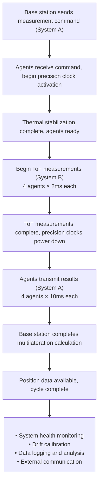

## Abstract

This document provides a comprehensive overview of the physics, mathematics, and hardware considerations for a time-of-flight (ToF) based distance measurement system designed for GPS-denied multilateration. The system enables multiple agents to determine distances to a rover using radio signal propagation time, accounting for clock precision, hardware constraints, and time synchronization challenges in distributed systems.

  

## 1. Core Variables for Distance Calculation Using Time-of-Flight

  

### 1.1 Fundamental Physics

The distance between two radio transceivers is determined using the fundamental relationship between distance, speed, and time:

  

**Basic Time-of-Flight Equation:**
$$d = c \cdot t$$  

Where:

- $d$ = distance between transceivers (meters)

- $c$ = speed of light in vacuum ≈ 2.998 × 10⁸ m/s

- $t$ = time for signal to travel one-way (seconds)

  

### 1.2 Two-Way Time-of-Flight (Round-Trip)

For practical implementation using send-acknowledge protocols:

  
$$d = (c \cdot Δt) / 2
$$  

Where:

- $Δt$ = round-trip time (T₂ - T₁)

- $T₁$ = time when signal is transmitted

- $T₂$ = time when acknowledgment is received

- Division by 2 accounts for round-trip nature

  

### 1.3 Additional Physical Considerations

  

**Signal Propagation in Air:**
$$c_{\text{air}} = \frac{c}{n_{\text{air}}} \approx 2.997 \cdot 10^8 \ \text{m/s}$$
Where $n_air ≈ 1.0003$ (refractive index of air at standard conditions)

  

**Environmental Factors:**

- Temperature variations: ±0.1% speed variation per 30°C

- Humidity effects: negligible for radio frequencies

- Atmospheric pressure: minimal impact at operational altitudes

  

## 2. Relationship Between Clock Precision and Distance Accuracy

  

### 2.1 Error Propagation Analysis

  

Any error in time measurement directly translates to distance error:

  
$$Δd = c \cdot Δt
$$  

**For round-trip measurements:**
$$\Delta d = \frac{c \cdot \sigma_{t}}{2}$$
  

Where $\sigma_{t}$ is the uncertainty in round-trip time measurement.

  

### 2.2 Clock Precision to Distance Accuracy Conversion

  

**Required Time Resolution for Target Accuracy:**
$$\Delta t = \frac{\Delta d}{c}$$

**Required Clock Frequency:**
$$f_{\text{clock}} = \frac{1}{\Delta t} = \frac{c}{\Delta d}$$
  

### 2.3 System-Level Position Accuracy

  

For a multilateration system with $n$ agents, each with distance measurement accuracy $σ_d$, the position accuracy follows error propagation principles:

  

**Geometric Dilution of Precision (GDOP):**
$$\sigma_{\text{position}} = \text{GDOP} \cdot \sigma_d$$

  

**For well-conditioned geometry (4+ agents):**
$$\sigma_{\text{position}} \approx \sqrt{\frac{\sigma_d^2}{n}} \times k_{\text{geometry}}$$

  

Where $k_{\text{geometry}}$ typically ranges from 1.2 to 2.5 depending on agent spatial distribution.

  

**Volume Uncertainty (for 3D positioning):**
$$\sigma_{\text{V}} = \frac{4}{3} \pi \cdot \sigma_{\text{position}}^3$$

  

### 2.4 Reference Table: Clock Precision vs. Accuracy

  

| Clock Precision | Distance Accuracy | Positional Accuracy (4 agents) | Volume Uncertainty |
| --------------- | ----------------- | ------------------------------ | ------------------ |
| 1 ms (10⁻³ s)   | 1.50 × 10⁵ m      | 1.83 × 10⁵ m                   | 2.57 × 10¹⁶ m³     |
| 1 μs (10⁻⁶ s)   | 1.50 × 10² m      | 1.83 × 10² m                   | 2.57 × 10⁷ m³      |
| 1 ns (10⁻⁹ s)   | 1.50 × 10⁻¹ m     | 1.83 × 10⁻¹ m                  | 2.57 × 10⁻² m³     |
| 1 ps (10⁻¹² s)  | 1.50 × 10⁻⁴ m     | 1.83 × 10⁻⁴ m                  | 2.57 × 10⁻¹¹ m³    |
  

*Assumptions: GDOP = 1.22, spherical uncertainty model*

  

## 3. Hardware Constraints for 10 cm³ Accuracy

  

### 3.1 Clock Precision Requirements

  

**Target Accuracy:** 10 cm³ volume → $\sigma_{\text{position}} \approx 0.134 \text{ m}$

  

**Required distance accuracy:**

$$\sigma_d = \frac{\sigma_{\text{position}}}{\mathrm{GDOP} \times \sqrt{\frac{1}{n}}}$$

$$\sigma_d = \frac{0.134}{1.22 \times 0.5} = 0.22 \text{ m}$$

  

**Required clock precision:**
$$\Delta t = \frac{\sigma_d}{c} = \frac{0.22}{2.998 \times 10^{8}} = 7.34 \times 10^{-10} \text{ s} = 734 \text{ ps}$$
  

**Required clock frequency:**
$$f_{\text{clock}} \geq \frac{1}{\Delta t} = 1.36 \times 10^{9} \text{ Hz} \approx 1.4 \text{ GHz}$$

### 3.2 Radio Signal Frequency Constraints

  

**Nyquist Sampling Criterion:**

For accurate amplitude measurement, the sampling frequency must be at least twice the signal frequency:
$$f_{\text{clock}} \geq 2 \times f_{\text{signal}}$$
**Maximum allowable signal frequency:**
$$f_{\text{signal}} \leq \frac{f_{\text{clock}}}{2} = \frac{1.4\, \text{GHz}}{2} = 700\, \text{MHz}$$
**Practical safety margin (10×):**
$$f_{\text{signal}} \leq 70\, \text{MHz} \quad \text{(recommended)}$$

### 3.3 Minimum Distance Constraints

  

**Wavelength calculation:**
$$\lambda = \frac{c}{f_{\text{signal}}}$$
**For 70 MHz signal:**
$$\lambda = \frac{2.998 \times 10^{8}}{70 \times 10^{6}} = 4.28 \text{ m}$$
**Minimum separation distance:**
$$d_{\text{min}} = \lambda = 4.28 \text{ m}$$
This ensures agents operate in the far-field region where plane wave approximation is valid.

  

### 3.4 Maximum Distance Constraints

  

**Free Space Path Loss (FSPL):**
$$\text{FSPL (dB)} = 20 \log_{10}(d) + 20 \log_{10}(f) + 32.44$$
Where $d$ is in km and $f$ is in MHz.

**Link Budget Analysis:**

For a $1\,W$ transmitter ($30\,dBm$) and $-100\,dBm$ receiver sensitivity:

$$\text{Link Budget} = 30 - (-100) = 130\, \text{dB}$$

**Maximum range calculation:**

$$\begin{aligned}
130 &= 20 \log_{10}(d) + 20 \log_{10}(70) + 32.44 \\
130 &= 20 \log_{10}(d) + 36.9 + 32.44 \\
20 \log_{10}(d) &= 130 - 36.9 - 32.44 = 60.66 \\
d &= 10^{\frac{60.66}{20}} = 1.07\, \text{km}
\end{aligned}$$

**Practical maximum range:** ~1 km (line-of-sight)

### 3.5 Hardware Summary for 10 cm³ Accuracy

  

- **Clock Precision:** $\geq 1.4\ \text{GHz}$ ($734 ps$ resolution)

- **Signal Frequency:** ≤ $70 MHz$ (recommended)

- **Minimum Agent Distance:** $\geq 4.3\ \text{m}$

- **Maximum Agent Distance:** $\leq 1.0\ \text{km}$ ($1W$ transmitter)

- **Required Transmit Power:** $\geq 1\,W$ (for $1\,km$ range)
  

## 4. Time Offset Calibration and Compensation

  

### 4.1 Processing Delay Sources

  

**Agent Processing Delays:**

- Signal detection and processing: $T_{\text{detect}}$

- Acknowledgment generation: $T_{\text{ack\_gen}}$

- Transmission preparation: $T_{\text{tx\_prep}}$

  

**Rover Processing Delays:**

- Signal reception and processing: $T_{\text{rx\_proc}}$

- Acknowledgment transmission: $T_{\text{ack\_tx}}$

  

**Total System Delay:**
$$T_{\text{offset}} = T_{\text{detect}} + T_{\text{ack\_gen}} + T_{\text{tx\_prep}} + T_{\text{rx\_proc}} + T_{\text{ack\_tx}}$$

  

### 4.2 Calibration Procedure

  

**Setup:** Two systems at known distance $d_known$

  

**Measurement Process:**

1. Agent transmits signal at time $T_1$

2. Rover receives and immediately acknowledges

3. Agent receives acknowledgment at time $T_2$

4. Calculate apparent distance: $d_{\text{measured}} = c \times \frac{(T_2 - T_1)}{2}$

**Offset Calculation for Distance:**
$$D_{\text{offset}} = d_{\text{known}} - d_{\text{measured}}$$

**Offset Calculation for Time:**
$$T_{\text{offset}} = \frac{2 \times D_{\text{offset}}}{c}$$

**Corrected Distance Formula:**

$$d_{\text{actual}} = c \times \frac{(T_2 - T_1 - T_{\text{offset}})}{2}$$

### 4.3 Calibration Example

  

**Known distance:** $10.00 m$

**Measured time:** $70.5 ns$

**Calculated distance:** $10.56 m$

  

**Distance offset:**

$$\text{Distance}_{\text{offset}} = 10.00 - 10.56 = -0.56 \text{ m}$$

**Time offset:**

$$T_{\text{offset}} = \frac{2 \times (-0.56)}{2.998 \times 10^{8}} = -3.74 \times 10^{-9} \text{ s} = -3.74 \text{ ns}$$

**Correction factor:** Add $3.74 ns$ to all future measurements.

  

## 5. Dual Communication Architecture and Clock Management

  

### 5.1 System Architecture Overview

  

The system employs a dual communication architecture to separate high-precision timing operations from general communications:

  

**Communication System A: Command & Control**

- Base station ↔ Agents communication

- General health checks, status updates, positioning commands

- Lower bandwidth requirements (~$1-10 kbps$)

- Standard radio protocols (LoRa, WiFi, etc.)

- Continuous operation with standard system clocks

  

**Communication System B: Precision Timing**

- Agents ↔ Rover distance measurements

- High-precision time-of-flight operations

- Requires high-speed, precision clocks ( $\geq 1.4\ \text{GHz}$)

- Activated only during measurement windows

- Power-managed operation to reduce thermal drift

  

### 5.2 Clock Management Strategy

  

**Standard System Clocks:**

- Used for general operations and Communication System A

- Typical precision: $1-100 MHz$

- Continuous operation

- Lower power consumption

- Used for scheduling precision measurement windows

  

**Precision Timing Clocks:**

- Used exclusively for ToF distance measurements

- Required precision: $\geq 1.4$ GHz for 10 cm³ accuracy

- **Selective activation:** Only powered during measurement cycles

- Thermal stabilization period before measurement

- Power-down between measurement windows

  

### 5.3 Measurement Cycle Management

  

**Precision Clock Activation Sequence:**

  

1. **Pre-measurement Phase (100-500 ms):**

   - Base station sends measurement command via System A

   - Agents activate precision clocks

   - Thermal stabilization period

   - Clock calibration/drift check

  

2. **Measurement Phase (1-10 ms):**

   - Agents perform ToF measurements with rover via System B

   - High-precision timestamps recorded

   - Distance calculations completed

  

3. **Data Transmission Phase (10-50 ms):**

   - Agents transmit results to base station via System A

   - Precision clocks can be powered down

   - Base station applies timestamp replacement

  

4. **Standby Phase (remainder of cycle):**

   - Precision clocks powered down to minimize drift

   - System maintains readiness via standard clocks

  

### 5.4 Distributed Time Synchronization

  

**Clock Offset Model (Modified for Dual Architecture):**

  

Each agent maintains two time references:
$$t_{\text{standard}} = t_{\text{universal}} + \delta_{\text{standard}} + \epsilon_{\text{standard}} \times t$$
$$t_{\text{precision}} = t_{\text{universal}} + \delta_{\text{precision}} + \epsilon_{\text{precision}} \times t_{\text{active}}$$  

Where:

- $t_active$ = cumulative active time of precision clock

- $ε_precision$ << $ε_standard$ due to selective operation

  

**Base Station Timestamp Replacement:**

  

**Advantage:** Eliminates need for perfect clock synchronization between systems

  

**Process:**

1. Agent measures distance using precision clock (System B)

2. Agent records measurement with standard clock timestamp

3. Agent transmits via System A: \{distance, standard\_timestamp\}

4. Base station receives at time $T_{\text{base}}$ (standard clock)

5. Base station replaces timestamp: \{distance, $T_{\text{base}}$\}

**Temporal Window Constraint:**

For position updates every 1 second, all distance measurements must be collected within a synchronization window:
$$\Delta t_{\text{sync}} \leq \frac{\sigma_{\text{position}}}{v_{\max} \times GDOP}$$

Where $v_{\max}$ is maximum rover velocity.

**For 10 cm accuracy and 10 m/s max velocity:**
$$\Delta t_{\text{sync}} \leq \frac{0.1}{10 \times 1.22} = 8.2 \text{ ms}$$

### 5.5 Measurement Timing Requirements (Dual System)

**For 1 Hz position updates with 4 agents:**

**Complete measurement cycle timing:**
$$T_{\text{total}} = T_{\text{stabilization}} + T_{\text{measure phase}} + T_{\text{transmit phase}} + T_{\text{compute}}$$
**Detailed timing breakdown:**

- $T_{\text{stabilization}} = 200 \text{ ms}$ (precision clock thermal stabilization)  
- $T_{\text{measure phase}} = 4 \times 2 \text{ ms} = 8 \text{ ms}$ (ToF measurements via System B)  
- $T_{\text{transmit phase}} = 4 \times 10 \text{ ms} = 40 \text{ ms}$ (data transmission via System A)  
- $T_{\text{compute}} = 5 \text{ ms}$ (multilateration calculation)  

**Total active cycle time:**
$$T_{\text{total}} = 200 + 8 + 40 + 5 = 253 \text{ ms}$$
**Precision clock duty cycle:**
$$\text{Duty\_cycle} = \frac{T\_{\text{stabilization}} + T\_{\text{measure phase}}}{T\_{\text{total}}} = \frac{208}{253} = 82\%$$
**Available time budget:**  
$1000 \text{ ms} - 253 \text{ ms} = 747 \text{ ms}$ (safety margin)

  
**Power Optimization:**

- Precision clocks active: 208 ms per cycle (20.8% of total time)  
- Standard clocks active: 100% of time  
- Significant power savings compared to continuous precision operation

### 5.6 Communication Bandwidth Requirements (Dual System)

  

**System A (Command & Control):**

- Position measurement commands: 32 bits/command

- Agent status/health: 64 bits/agent/cycle

- Distance measurement results: 104 bits/measurement

- Protocol overhead: ×2-3 typical

  

**For 4 agents at 1 Hz:**
$$\text{System A data rate} = \frac{(32 + 4 \times 64 + 4 \times 104) \times 3}{1 \text{ s}} = 2.1 \text{ kbps}$$
**System B (Precision Timing):**

- ToF signal packets: Minimal data payload  
- Focus on timing precision rather than data throughput  
- Bandwidth: < 100 bps (signal synchronization only)  
- Active only during measurement phases (8 ms per cycle)  

**Total communication overhead:**
$$\text{Combined bandwidth} \approx 2.2 \text{ kbps (easily achievable)}$$
### 5.7 Thermal Management and Clock Stability

**Precision Clock Thermal Considerations:**

**Temperature-Frequency Relationship:**
$$\frac{\Delta f}{f} = \alpha \times \Delta T$$
Where $\alpha \approx 10^{-6}/^\circ C$ for quality crystal oscillators

**Thermal Stabilization Requirements:**

- Target temperature stability: ±0.1°C  
- Stabilization time: 100–500 ms (depending on thermal mass)  
- Frequency stability: ±0.1 ppm after stabilization

  
**Power Cycling Benefits:**

- Reduced thermal drift accumulation

- Consistent starting conditions for each measurement

- Lower average power consumption

- Extended hardware lifetime

  

**Thermal Stabilization Protocol:**

1. Activate precision clock and heating element

2. Monitor temperature until stable (±0.1°C)

3. Perform brief frequency calibration check

4. Begin measurement sequence

5. Power down after measurement complete

  

## 6. Error Budget Analysis (Dual System Architecture)

  

### 6.1 Distance Measurement Error Sources

**Precision Clock Errors:**
$$\sigma_{\text{clock}} = \frac{\text{clock\_resolution}}{\sqrt{12}} \approx 0.29 \times \text{clock\_resolution}$$
**Thermal Stabilization Error:**
$$\sigma_{\text{thermal}} = \alpha \times \Delta T_{\text{residual}} \times \frac{c}{2 \times f_{\text{signal}}}$$
For ±0.1°C stability: 
$$\sigma_{\text{thermal}} \approx 1.5\, \text{cm}$$

**Clock Activation Jitter:**
$$\sigma_{\text{activation}} \approx 100\, \text{ps} \quad \text{(typical for precision oscillator startup)}$$
Equivalent to 1.5 cm distance error.

**Signal noise error:**
$$\sigma_{\text{noise}} = \frac{c}{2 \times BW \times \sqrt{SNR}}$$
**Multipath error:**
$$\sigma_{\text{multipath}} \approx 0.1 \times \lambda \quad \text{(in urban environments)}$$
**Processing delay stability:**
$$\sigma_{\text{processing}} \approx \pm 1\, \text{ns} \quad \text{(typical for digital systems)}$$
**Communication System Timing Uncertainty:**
$$\sigma_{\text{comm}} = \frac{\text{standard\_clock\_resolution}}{\sqrt{12}}$$
For 100 MHz standard clock: $\sigma_{\text{comm}} \approx 2.9\, \text{ns} \rightarrow 87\, \text{cm}$

---

### 6.2 Combined Error Analysis (Modified for Dual Architecture)

**Root Sum Square (RSS) combination:**
$$\sigma_{\text{total}} = \sqrt{
\sigma_{\text{clock}}^2 + \sigma_{\text{thermal}}^2 + \sigma_{\text{activation}}^2 + \sigma_{\text{noise}}^2 + \sigma_{\text{multipath}}^2 + \sigma_{\text{processing}}^2
}$$
**Note:** $\sigma_{\text{comm}}$ cancels out due to base station timestamp replacement.

**For 1.4 GHz precision clock, 70 MHz signal, 20 dB SNR:**

- $\sigma_{\text{clock}} = 0.29 \times 714\, \text{ps} = 207\, \text{ps} \rightarrow 6.2\, \text{cm}$ 
- $\sigma_{\text{thermal}} \approx 1.5\, \text{cm}$ 
- $\sigma_{\text{activation}} \approx 1.5\, \text{cm}$ 
- $\sigma_{\text{noise}} \approx 500\, \text{ps} \rightarrow 7.5\, \text{cm}$ 
- $\sigma_{\text{multipath}} \approx 43\, \text{cm} \quad (4.3\, \text{m wavelength})$ 
- $\sigma_{\text{processing}} \approx 30\, \text{cm}$ 

**Total distance error:**
$$\sigma_{\text{total}} = \sqrt{6.2^2 + 1.5^2 + 1.5^2 + 7.5^2 + 43^2 + 30^2} = 53.6\, \text{cm}$$

**Impact of Dual Architecture:**

- **Positive:** Communication timing errors eliminated

- **Negative:** Additional thermal and activation errors

- **Net effect:** Marginal increase in total error (~0.2 cm)

  

## 7. System Implementation Considerations

  

### 7.1 Hardware Architecture Requirements

  

**Agent Hardware Configuration:**

- **Standard System Clock:** 100 MHz (continuous operation)

- **Precision Timing Clock:** $\geq 1.4\ \text{GHz}$ (selective activation)

- **Dual Radio Systems:**

  - Radio A: Command/control (LoRa, WiFi, etc.)

  - Radio B: Precision timing (optimized for ToF)

- **Thermal Management:** Heating elements and temperature sensors

- **Power Management:** Switchable power domains

  

**Base Station Configuration:**

- **Standard System Clock:** 100 MHz (continuous operation)

- **Communication Interface:** System A only (no precision timing required)

- **Processing Power:** Sufficient for real-time multilateration

- **Data Storage:** Logging and analysis capabilities

  

### 7.2 Operational Workflow

**Typical Measurement Cycle:**

### 7.3 Power Consumption Analysis

  

**Precision Clock Power Budget:**

- Active time per cycle: 218ms (stabilization + measurement)

- Duty cycle: 21.8%

- Estimated power reduction: 60-70% vs. continuous operation

  

**Total System Power:**

- Standard clocks: 1W continuous

- Precision clocks: 5W × 0.218 = 1.09W average

- Radio systems: 2W average

- **Total per agent: ~4W average vs. ~8W continuous precision**

  

## 8. Conclusion

  

The dual communication architecture provides several key advantages for high-precision distance measurement:

  

1. **Power Efficiency:** reduction in precision clock power consumption through selective activation

2. **Thermal Stability:** Consistent thermal conditions for each measurement cycle, reducing drift accumulation

3. **System Robustness:** Separation of critical timing operations from general communications

4. **Scalability:** Standard communication protocols can handle command/control while precision timing remains optimized

5. **Error Isolation:** Communication timing errors eliminated through timestamp replacement