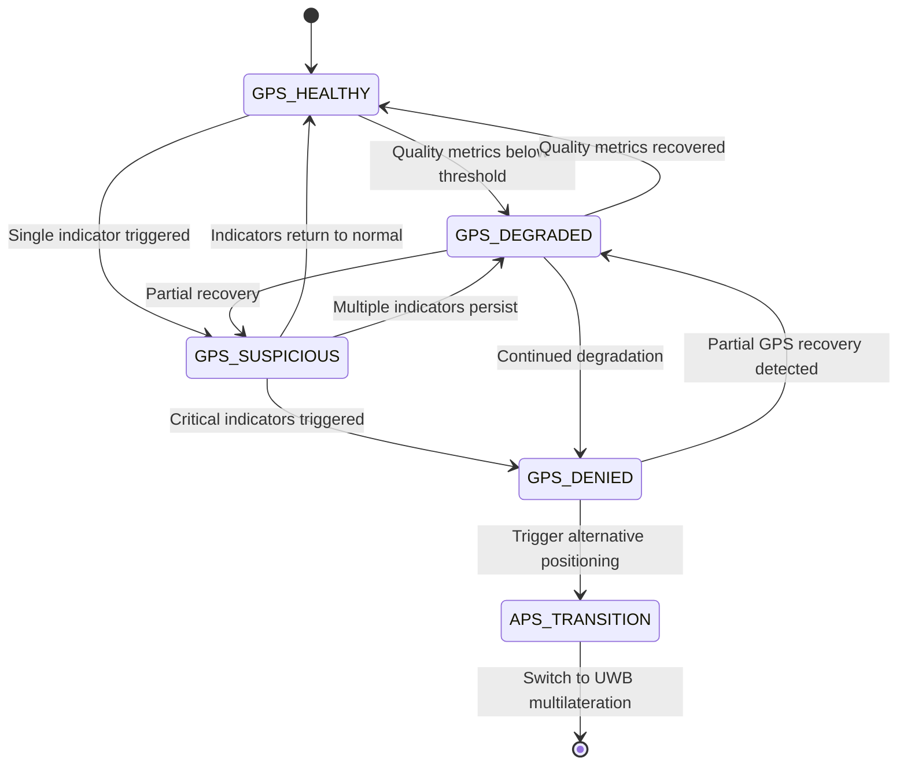

# GPS Denial Detection

## Abstract

This document provides comprehensive technical guidance for detecting GPS denial and jamming in autonomous rover systems operating in diverse environments. The detection system monitors multiple indicators across signal quality, integrity, and cross-sensor validation to enable rapid transition to Alternative Positioning Systems (APS) when GPS becomes unreliable.

## 1. Overview

### 1.1 System Architecture

The GPS denial detection system operates as a parallel monitoring subsystem that continuously evaluates GPS signal health while the rover conducts land surveys. Detection operates at 1 Hz with sub-second response times to ensure minimal positioning downtime during GPS outages.

**Primary Detection Categories:**
- Signal Quality Metrics
- Data Integrity Monitoring  
- Position/Velocity Consistency Checks
- Cross-Sensor Validation
- RTK-Specific Indicators (when applicable)

### 1.2 Detection Requirements

**Target Specifications:**
- Detection Latency: ≤ 1 second
- Position Update Rate: 1 Hz
- Volume Accuracy Constraint: 10 cm³ (when operating)
- False Positive Rate: < 1%
- Operating Environments: All-terrain outdoor land survey

## 2. Signal Quality Indicators

### 2.1 Satellite Lock Monitoring

**Lock Loss/Reacquisition Detection:**

The system monitors GPS receiver lock status through continuous evaluation of fix quality flags and satellite tracking behavior.

**Key Indicators:**
- Fix quality degradation (3D → 2D → No Fix)
- Frequent lock loss and reacquisition cycles
- LED status indicators showing intermittent operation
- Time-to-first-fix (TTFF) degradation

**Detection Algorithm:**

```
PSEUDOCODE: Lock Status Monitoring
WHILE system_active:
    current_fix_status = get_gps_fix_quality()
    
    IF current_fix_status < previous_fix_status:
        lock_degradation_count += 1
        
    IF lock_degradation_count > THRESHOLD_DEGRADATION:
        trigger_gps_denial_flag()
        
    IF fix_reacquisition_time > THRESHOLD_REACQ_TIME:
        trigger_gps_denial_flag()
```

**Thresholds:**
- Lock degradation events: > 3 in 10 seconds
- Reacquisition time: > 30 seconds (cold start)
- Reacquisition time: > 5 seconds (warm start)

### 2.2 Satellite Count Monitoring

**Satellite Visibility Analysis:**

Sudden drops in tracked satellites indicate potential jamming or signal denial, particularly when environmental conditions remain constant.

**Mathematical Relationship:**

For GPS accuracy requirements within 10 cm³ volume:

```
Position Dilution of Precision (PDOP):
PDOP = √(σx² + σy² + σz²) / σr

Where:
- σr = user equivalent range error
- Minimum satellites for 3D positioning: 4
- Recommended satellites for high accuracy: ≥ 6
```

**Detection Parameters:**
- Normal satellite count: 8-12 satellites (open sky)
- Warning threshold: < 6 satellites
- Critical threshold: < 4 satellites
- Rate of change: > 50% drop in < 5 seconds

### 2.3 Signal Strength Analysis

**Carrier-to-Noise Ratio (C/N₀) Monitoring:**

Signal strength degradation across all channels simultaneously indicates broadband jamming rather than selective fading.

**Normal Operating Values:**
- Open field: 40-50 dB-Hz
- Light foliage: 35-45 dB-Hz  
- Urban canyons: 25-40 dB-Hz
- Heavy foliage: 20-35 dB-Hz

**Jamming Detection Thresholds:**

```
C/N₀ Analysis:
IF all_channels_C/N₀ < (baseline_C/N₀ - 10 dB):
    potential_jamming = TRUE
    
IF C/N₀_drop_rate > 5 dB/second:
    active_jamming = TRUE
```

**Automatic Gain Control (AGC) Monitoring:**

AGC voltage increases indicate receiver attempts to compensate for elevated noise floor from jamming.

```
AGC Voltage Analysis:
normal_AGC_range = [1.8V, 2.5V]
jamming_threshold = 3.0V

IF AGC_voltage > jamming_threshold:
    jamming_detected = TRUE
```

## 3. Data Integrity Monitoring

### 3.1 Message Corruption Detection

**NMEA/UBX Checksum Validation:**

Corrupted GPS messages indicate signal interference affecting data integrity.

**Monitoring Parameters:**
- Checksum failure rate: > 5% indicates interference
- Truncated sentence rate: > 2% indicates signal disruption
- Parity error frequency: > 1% indicates data corruption

### 3.2 Receiver Autonomous Integrity Monitoring (RAIM)

**RAIM Algorithm Implementation:**

RAIM detects inconsistencies in satellite measurements that could indicate jamming or spoofing.

**Mathematical Foundation:**

```
RAIM Test Statistic:
T = (r - H*x)ᵀ * W * (r - H*x)

Where:
- r = pseudorange measurements
- H = observation matrix
- x = position/time solution
- W = weighting matrix

Threshold Comparison:
IF T > χ²(α, df):
    integrity_failure = TRUE
```

**Detection Thresholds:**
- Horizontal Alert Limit (HAL): 10 meters
- Vertical Alert Limit (VAL): 15 meters
- Time to Alert: < 1 second

## 4. Position and Velocity Consistency

### 4.1 Position Jump Detection

**Unrealistic Movement Analysis:**

The system monitors for sudden position changes that exceed physical rover capabilities.

**Detection Algorithm:**

```
Position Jump Detection:
max_rover_acceleration = 2.0 m/s²  # Conservative estimate
time_interval = 1.0 s  # Update rate

expected_max_displacement = 0.5 * max_rover_acceleration * time_interval²
position_jump = √((x₂-x₁)² + (y₂-y₁)² + (z₂-z₁)²)

IF position_jump > (expected_max_displacement * safety_factor):
    position_anomaly = TRUE
```

**Safety Factors by Environment:**
- Open field: 2.0
- Urban canyon: 3.0  
- Forest canopy: 4.0
- Mountainous terrain: 5.0

### 4.2 Velocity Validation

**Speed and Heading Consistency:**

Cross-validation between GPS-derived velocity and rover's physical capabilities.

```
Velocity Consistency Check:
max_rover_speed = 10 m/s  # Surveying rover typical maximum

IF gps_velocity > max_rover_speed:
    velocity_anomaly = TRUE
    
IF abs(gps_heading_change) > max_angular_velocity * time_interval:
    heading_anomaly = TRUE
```

## 5. RTK-Specific Indicators

### 5.1 RTK Fix Status Monitoring

**Fix Quality Degradation:**

RTK systems provide centimeter-level accuracy but are sensitive to signal interference.

**Status Hierarchy:**
1. RTK-FIX: Centimeter accuracy (target state)
2. RTK-FLOAT: Decimeter accuracy (degraded)
3. DGPS: Meter accuracy (significantly degraded)
4. Single Point: Multi-meter accuracy (unacceptable)

**Detection Logic:**

```
RTK Status Monitoring:
acceptable_states = [RTK_FIX, RTK_FLOAT]
current_rtk_status = get_rtk_status()

IF current_rtk_status NOT IN acceptable_states:
    rtk_degradation_time += time_interval
    
IF rtk_degradation_time > RTK_TIMEOUT_THRESHOLD:
    trigger_aps_transition()
```

### 5.2 Carrier-Phase Cycle Slip Detection

**Phase Continuity Monitoring:**

Cycle slips indicate loss of carrier phase lock critical for RTK positioning.

**Mathematical Detection:**

```
Cycle Slip Detection:
phase_difference = current_phase - predicted_phase
cycle_slip_threshold = 0.5 cycles  # λ/2

IF abs(phase_difference) > cycle_slip_threshold:
    cycle_slip_detected = TRUE
    
simultaneous_slips = count_satellites_with_slips()

IF simultaneous_slips > 2:
    interference_likely = TRUE
```

## 6. Cross-Sensor Validation

### 6.1 INS/GPS Comparison

**Inertial Navigation Cross-Check:**

Comparison between GPS position updates and inertial navigation predictions.

**Innovation Analysis:**

```
Innovation Vector Calculation:
innovation = gps_position - predicted_position_from_ins
innovation_magnitude = ||innovation||

statistical_threshold = 3 * σ_expected  # 3-sigma test

IF innovation_magnitude > statistical_threshold:
    gps_ins_inconsistency = TRUE
```

**Expected Accuracy Standards:**
- INS drift rate: < 1 m/hour (tactical grade)
- GPS accuracy: < 3 m (95% confidence)
- Combined uncertainty: √(σ²ᵢₙₛ + σ²ᵍᵖˢ)

### 6.2 Wheel Odometry Integration

**Dead Reckoning Validation:**

Encoder-based distance measurements provide independent motion validation.

```
Odometry Cross-Check:
distance_traveled_gps = ||position_current - position_previous||
distance_traveled_wheels = wheel_encoder_distance

distance_discrepancy = abs(distance_traveled_gps - distance_traveled_wheels)
discrepancy_threshold = 0.1 * distance_traveled_wheels  # 10% tolerance

IF distance_discrepancy > discrepancy_threshold:
    odometry_gps_mismatch = TRUE
```

## 7. Environmental Considerations

### 7.1 Environment-Specific Detection Parameters

**Open Field Environments:**
- Expected satellite count: 10-12
- Expected C/N₀: 45-50 dB-Hz
- Multipath error: < 0.5 m
- Detection sensitivity: High (low false positive tolerance)

**Forest Canopy:**
- Expected satellite count: 4-8
- Expected C/N₀: 25-40 dB-Hz  
- Multipath error: 1-3 m
- Detection sensitivity: Medium (higher tolerance for natural degradation)

**Urban Canyons:**
- Expected satellite count: 3-6
- Expected C/N₀: 20-35 dB-Hz
- Multipath error: 2-10 m
- Detection sensitivity: Low (high tolerance for reflections)

**Mountainous Terrain:**
- Expected satellite count: 4-9 (topography dependent)
- Expected C/N₀: 30-45 dB-Hz
- Multipath error: 0.5-2 m
- Detection sensitivity: Medium (variable based on terrain masking)

### 7.2 Adaptive Threshold Management

**Dynamic Threshold Adjustment:**

Detection thresholds adapt based on environmental classification and historical performance data.

```
Adaptive Threshold Algorithm:
baseline_threshold = get_environment_baseline(current_environment)
recent_performance = calculate_recent_gps_quality()
noise_floor_estimate = estimate_current_noise_floor()

adjusted_threshold = baseline_threshold * (1 + adaptation_factor)

Where adaptation_factor considers:
- Recent GPS quality trends
- Environmental noise estimates  
- Time of day effects (ionospheric activity)
- Seasonal variations
```

## 8. Detection State Machine

### 8.1 System States



### 8.2 State Transition Logic

**GPS_HEALTHY State:**
- All indicators within normal parameters
- Position accuracy meeting 10 cm³ constraint
- Full satellite constellation visible
- Signal strength nominal for environment

**GPS_SUSPICIOUS State:**
- Single quality indicator triggered
- Temporary degradation possible
- Enhanced monitoring active
- Prepare for potential APS transition

**GPS_DEGRADED State:**
- Multiple quality indicators below threshold
- Position accuracy degraded but still functional
- Increased monitoring frequency
- APS standby activation

**GPS_DENIED State:**
- Critical indicators triggered
- Position accuracy unacceptable
- Immediate APS transition required
- GPS monitoring continues for recovery detection

## 9. Detection Algorithm Integration

### 9.1 Multi-Indicator Fusion

**Weighted Decision Algorithm:**

Individual indicators contribute to an overall GPS health score with environment-specific weightings.

```
GPS Health Score Calculation:
health_score = Σ(wᵢ × indicatorᵢ)

Where indicators include:
- Satellite count (w₁ = 0.2)
- Signal strength (w₂ = 0.25)  
- Position consistency (w₃ = 0.3)
- Data integrity (w₄ = 0.15)
- Cross-sensor validation (w₅ = 0.1)

Decision Thresholds:
health_score > 0.8: GPS_HEALTHY
0.5 < health_score ≤ 0.8: GPS_DEGRADED  
0.3 < health_score ≤ 0.5: GPS_SUSPICIOUS
health_score ≤ 0.3: GPS_DENIED
```

### 9.2 Temporal Filtering

**Detection Persistence Requirements:**

Prevents false positives from temporary signal variations while maintaining rapid response to genuine threats.

```
Temporal Filter Implementation:
detection_counter = 0
confirmation_threshold = 3  # Require 3 consecutive detections

FOR each 1Hz update cycle:
    current_health = calculate_gps_health()
    
    IF current_health indicates_denial:
        detection_counter += 1
    ELSE:
        detection_counter = max(0, detection_counter - 1)
        
    IF detection_counter >= confirmation_threshold:
        confirm_gps_denial()
        initiate_aps_transition()
```

## 10. Hardware Requirements

### 10.1 GPS Receiver Specifications

**Minimum Receiver Capabilities:**
- Multi-constellation support (GPS, GLONASS, Galileo, BeiDou)
- Raw measurement output (C/N₀, AGC, satellite ephemeris)
- NMEA and binary protocol support
- Update rate: ≥ 1 Hz
- Cold start TTFF: < 30 seconds
- Hot start TTFF: < 5 seconds

**RTK-Specific Requirements:**
- Dual-frequency capability (L1/L2 or L1/L5)
- Carrier phase measurement output
- RTCM correction input capability
- Centimeter-level accuracy when corrections available
- Cycle slip detection and reporting

### 10.2 Integration Hardware

**Sensor Fusion Capabilities:**
- Inertial Measurement Unit (IMU): 6-DOF minimum, 9-DOF preferred
- Wheel encoder interfaces: Quadrature decoder capability
- Communication interfaces: UART, SPI, CAN bus support
- Processing capability: Real-time filtering and state estimation

**Environmental Considerations:**
- Operating temperature: -40°C to +85°C
- Vibration resistance: Military standard compliance
- Moisture protection: IP67 rating minimum
- Electromagnetic compatibility: FCC Part 15 compliance

## 11. Calibration Requirements

### 11.1 Baseline Calibration

**Environmental Baseline Establishment:**

Each operating environment requires baseline measurements for adaptive threshold setting.

**Calibration Procedure:**
1. Deploy rover in target environment for extended period (≥ 4 hours)
2. Record all GPS quality metrics under known good conditions  
3. Calculate statistical distributions (mean, standard deviation)
4. Establish detection thresholds at 2-3 sigma confidence levels
5. Validate false positive rates through extended testing

### 11.2 Cross-Sensor Calibration

**INS/GPS Alignment:**
- Static alignment: 15-minute stationary initialization
- Dynamic alignment: Figure-8 maneuvers for accelerometer/gyroscope calibration
- Magnetic calibration: 360° rotation in multiple planes

**Wheel Odometry Calibration:**
- Known distance travel test (minimum 100 meters)
- Surface-specific calibration for different terrain types
- Slip factor determination for various ground conditions

## 12. Performance Validation

### 12.1 Detection Performance Metrics

**Key Performance Indicators:**
- Detection Latency: Mean time from GPS denial to detection
- False Positive Rate: Incorrect denial detections per operating hour
- False Negative Rate: Missed denial events per operating hour  
- Availability: Percentage of time position solution is available

**Target Performance Standards:**
- Detection Latency: < 2 seconds (95th percentile)
- False Positive Rate: < 0.1% per hour
- False Negative Rate: < 0.01% per hour
- System Availability: > 99.9%

### 12.2 Test Scenarios

**Controlled Jamming Tests:**
- Progressive signal degradation simulation
- Selective frequency jamming
- Broadband noise injection
- Spoofing attack simulation

**Environmental Stress Tests:**
- Rapid environment transitions (open field to forest)
- Extended operation in challenging environments
- Temperature cycling and vibration testing
- Long-duration reliability assessment

## 13. Implementation Considerations

### 13.1 Computational Requirements

**Processing Load:**
- Real-time filtering: < 10% CPU utilization
- Multi-indicator fusion: < 5% CPU utilization  
- State machine management: < 1% CPU utilization
- Data logging: < 2% CPU utilization

**Memory Requirements:**
- Historical data buffer: 100 MB (1 hour at 1 Hz)
- Calibration parameters: 10 MB per environment
- Algorithm workspace: 50 MB
- Total system memory: 512 MB recommended

### 13.2 Integration Guidelines

**Software Architecture:**
- Modular design with replaceable components
- Standard interfaces for sensor integration
- Configurable parameters for different platforms
- Comprehensive logging and diagnostic capabilities

**Real-time Constraints:**
- Hard deadline: 1-second detection latency
- Soft deadline: 100ms for individual indicator calculations
- Interrupt priority: GPS monitoring at high priority level
- Thread management: Separate threads for each major function