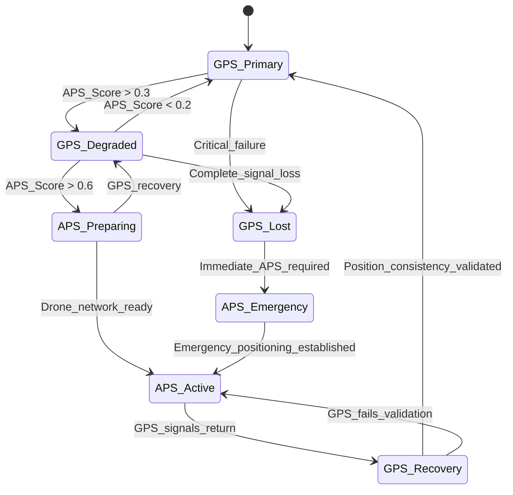

# Alternative Positioning System (APS) Triggering Documentation

## Abstract

This document provides comprehensive guidelines for triggering the Alternative Positioning System (APS) when GPS denial or degradation is detected during land surveying operations. The APS utilizes UWB-based multilateration with drone agents to maintain positioning accuracy within 10 cm³ volume uncertainty while operating in GPS-denied environments.

## 1. System Overview

### 1.1 Operational Context

The rover operates in a dual-positioning architecture where GPS and ToF-based positioning systems run in parallel. During normal operations, GPS provides primary positioning while the APS remains in standby mode. Upon detection of GPS denial or degradation, the system transitions to APS mode to maintain continuous positioning capability.

**Primary Use Case:** Land surveying operations in diverse outdoor environments including:
- Urban canyons with multipath interference
- Dense forest canopies
- Mountain valleys and terrain
- Open fields with potential jamming
- Industrial areas with RF interference

### 1.2 APS Components

**UWB-Based Multilateration System:**
- Multiple drone agents providing reference points
- Time-of-Flight distance measurements
- Real-time position calculation
- 10 cm³ volume accuracy target

**System Architecture:**
- Communication System A: Command & control (Base station ↔ Drones)
- Communication System B: Precision timing (Drones ↔ Rover)
- Dual clock architecture (Standard + Precision timing)

## 2. Triggering Criteria and Thresholds

### 2.1 GPS Quality Metrics

**Satellite Count Threshold:**
- **Critical Level:**
- **Warning Level:**
- **APS Activation:** 

**Signal Strength (C/N₀) Monitoring:**
- **Healthy Range:**
- **Degraded Range:**
- **Critical Level:**
- **APS Activation:**

**Dilution of Precision (DOP) Limits:**
- **Horizontal DOP (HDOP):**
- **Position DOP (PDOP):**
- **Geometric DOP (GDOP):**

### 2.2 Signal Continuity Monitoring

**Fix Loss Duration:**
- **Acceptable Gap:** < 2 seconds (normal GPS fluctuation)
- **Warning Period:** 2-5 seconds (begin APS preparation)
- **Critical Period:** > 5 seconds (force APS activation)

**Time-of-Week (TOW) Anomalies:**
- **Normal Increment:** Sequential 1-second steps
- **Anomaly Detection:** TOW jumps > 2 seconds or backwards progression
- **Action:** Immediate integrity flag, consider APS if persistent

### 2.3 Position/Velocity Consistency Checks

**Static Position Variance:**
When rover velocity < 0.1 m/s (stationary):
- **Normal Variance:** σ_position < 2.0 meters
- **Warning Level:** σ_position = 2.0-5.0 meters
- **Critical Level:** σ_position > 5.0 meters
- **Action:** APS activation if position "jumps" > 10 meters while stationary

**Velocity Reasonableness:**
- **Maximum Expected:** 15 m/s (54 km/h) for land survey rover
- **Acceleration Limit:** 5 m/s² (reasonable for terrain navigation)
- **Anomaly Detection:** Velocity > 20 m/s or acceleration > 8 m/s²
- **Action:** Flag GPS error, cross-check with IMU/odometry

## 3. Sensor Fusion Cross-Validation

### 3.1 INS/Odometry Comparison

**Dead-Reckoning Prediction Model:**
```
Position_predicted = Position_last + ∫(Velocity_IMU + Bias_correction) dt
Uncertainty_growth = σ_initial + σ_drift × √(Δt)
```

**Consistency Threshold:**
- **Acceptable Difference:** |GPS_position - INS_predicted| < 3 × σ_uncertainty
- **Warning Level:** Difference exceeds 3σ but < 5σ
- **Critical Level:** Difference > 5σ or consistently growing
- **Action:** APS activation when GPS-INS difference exceeds bounds for > 3 consecutive measurements

### 3.2 Velocity and Heading Cross-Check

**IMU-GPS Velocity Comparison:**
- **Angular Rate Consistency:** |GPS_heading_rate - IMU_yaw_rate| < 10°/s
- **Speed Consistency:** |GPS_speed - Wheel_encoder_speed| < 2 m/s
- **Acceleration Limits:** Ensure GPS-derived acceleration < 8 m/s²

**Heading Validation:**
```
Δheading_GPS = GPS_heading(t) - GPS_heading(t-1)
Δheading_IMU = ∫(IMU_yaw_rate) dt over same interval
Heading_error = |Δheading_GPS - Δheading_IMU|
```

**Threshold:** Heading_error > 15° triggers GPS integrity warning

### 3.3 UWB Cross-Validation (When Available)

**Distance Consistency Check:**
During GPS operation, continuously compare UWB-derived distances with GPS-calculated distances to drone positions:

```
Distance_GPS = √[(GPS_rover - GPS_drone)²]
Distance_UWB = ToF_measurement × c / 2
Distance_error = |Distance_GPS - Distance_UWB|
```

**Validation Criteria:**
- **Normal Operation:** Distance_error < 0.5 meters
- **GPS Degradation:** Distance_error = 0.5-2.0 meters
- **GPS Failure:** Distance_error > 2.0 meters consistently
- **Action:** Distance_error > 2.0m for > 3 measurements triggers APS preparation

## 4. Environmental and Operational Triggers

### 4.1 Environment-Specific Thresholds

**Urban Canyon Detection:**
- **Indicator:** Satellite elevation angles predominantly < 30°
- **C/N₀ Pattern:** Rapid fluctuations > 10 dB within 5 seconds
- **Multipath Signature:** Position oscillations > 5 meters with low velocity
- **Action:** Lower triggering thresholds by 20% in detected urban environments

**Forest Canopy Operations:**
- **Indicator:** Gradual C/N₀ degradation over 10-30 seconds
- **Satellite Loss Pattern:** Sequential loss rather than simultaneous
- **Expected Behavior:** HDOP gradual increase > 6.0
- **Action:** Extend warning periods to 10 seconds before APS activation

**Open Field with Potential Jamming:**
- **Indicator:** Simultaneous C/N₀ drop across all satellites
- **AGC Response:** Sudden increase in automatic gain control voltage
- **Pattern Recognition:** Uniform signal degradation regardless of satellite geometry
- **Action:** Immediate APS activation (< 1 second response time)

### 4.2 Operational State Considerations

**Survey Mission Critical Phases:**
- **High-Precision Requirements:** During active surveying (< 10 cm positioning required)
- **Transit Phases:** Lower precision acceptable (< 1 meter positioning)
- **Stationary Operations:** Position holding requirements (< 50 cm drift)

**Dynamic Triggering Thresholds:**
```
Threshold_multiplier = Mission_criticality_factor × Environment_factor × Rover_speed_factor

Where:
Mission_criticality_factor: 0.5 (survey) to 1.5 (transit)
Environment_factor: 0.7 (open) to 1.3 (urban/forest)
Rover_speed_factor: 0.8 (stationary) to 1.2 (high speed)
```

## 5. APS Activation Decision Logic

### 5.1 Multi-Criteria Decision Matrix

**Weighted Scoring System:**
```
APS_Score = W₁×Satellite_factor + W₂×Signal_factor + W₃×Continuity_factor + 
            W₄×Consistency_factor + W₅×Environment_factor

Where weights sum to 1.0:
W₁ = 0.25 (Satellite count and geometry)
W₂ = 0.20 (Signal strength and quality)
W₃ = 0.20 (Fix continuity and time consistency)
W₄ = 0.25 (Cross-sensor validation)
W₅ = 0.10 (Environmental adaptation)
```

**Individual Factor Calculations:**
```
Satellite_factor = (4 - Current_sat_count) / 4.0     [0.0 to 1.0]
Signal_factor = (35 - Average_CNR) / 35.0           [0.0 to 1.0]
Continuity_factor = Fix_loss_duration / 5.0         [0.0 to 1.0]
Consistency_factor = GPS_INS_error / Max_tolerance  [0.0 to 1.0]
Environment_factor = Environmental_risk_level       [0.0 to 1.0]
```

**Decision Thresholds:**
- **APS_Score < 0.3:** GPS reliable, continue normal operation
- **APS_Score 0.3-0.6:** GPS degraded, prepare APS (activate drones, begin calibration)
- **APS_Score > 0.6:** GPS unreliable, activate APS immediately

### 5.2 State Machine Implementation



### 5.3 Hysteresis and Anti-Chatter Logic

**Transition Delays:**
- **GPS → APS:** 1-5 seconds depending on criticality
- **APS → GPS:** 10-15 seconds minimum (ensure GPS stability)
- **Emergency Transitions:** < 1 second (critical failures)

**Anti-Chatter Implementation:**
```
State_change_timer = Current_time - Last_state_change
Min_dwell_time = 5.0 seconds (normal) or 1.0 seconds (emergency)

IF (APS_Score crosses threshold) AND (State_change_timer > Min_dwell_time):
    Allow state transition
ELSE:
    Maintain current state, continue monitoring
```

## 6. APS Preparation and Activation Sequence

### 6.1 Pre-Activation Phase (APS Preparation)

**Duration:** 2-10 seconds depending on system state

**Drone Network Activation:**
1. **Command Transmission:** Base station sends activation command to drone swarm
2. **Position Establishment:** Drones move to optimal multilateration geometry
3. **System Check:** Verify UWB communication links and ranging capability
4. **Calibration Update:** Perform quick time-offset calibration if needed

**Rover System Preparation:**
1. **Precision Clock Activation:** Begin thermal stabilization (200ms)
2. **UWB System Startup:** Initialize Time-of-Flight measurement capability
3. **Filter Initialization:** Prepare Kalman filter with current GPS-derived state
4. **Cross-Check Validation:** Verify INS/odometry consistency

### 6.2 APS Activation Sequence

**Critical Path Timeline (Target: < 500ms total):**

```mermaid
gantt
    title APS Activation Timeline
    dateFormat X
    axisFormat %L
    
    section Drone_Network
    Position_Verification : 0, 100
    UWB_Link_Test : 100, 200
    Range_Calibration : 200, 300
    
    section Rover_Systems
    Clock_Stabilization : 0, 200
    ToF_System_Ready : 200, 250
    Filter_Initialization : 250, 350
    
    section Integration
    First_Position_Fix : 350, 450
    Position_Validation : 450, 500
```



**Step-by-Step Process:**
1. **T+0ms:** Receive APS activation command
2. **T+50ms:** Drone positions verified, UWB links established
3. **T+200ms:** Rover precision clocks stabilized
4. **T+250ms:** First ToF measurements initiated
5. **T+350ms:** Initial multilateration solution computed
6. **T+450ms:** Position validated against INS prediction
7. **T+500ms:** APS declared active, GPS monitoring continues in background

### 6.3 Position Hand-off Protocol

**Coordinate System Alignment:**
The APS provides position relative to drone network. Conversion to GPS coordinates requires:
```
GPS_position = Drone_reference_GPS + APS_relative_position + Calibration_offset
```

**Hand-off Validation:**
```
Position_difference = |GPS_last_known - APS_first_fix|
Velocity_consistency = |GPS_velocity_last - APS_velocity_computed|

IF (Position_difference < 5.0 meters) AND (Velocity_consistency < 2.0 m/s):
    Accept APS hand-off
ELSE:
    Flag position discontinuity, apply additional validation
```

## 7. Performance Monitoring and Validation

### 7.1 APS Position Quality Assessment

**Real-Time Quality Metrics:**
- **GDOP Monitoring:** Geometric dilution of precision from drone constellation
- **Range Residuals:** RMS error in distance measurements
- **Solution Convergence:** Time to achieve 10 cm³ accuracy
- **Cross-Validation:** Consistency with IMU/odometry predictions

**Quality Thresholds for 10 cm³ Target:**
```
Required_distance_accuracy = √(Volume_target / (4π/3)) = √(0.1 / 4.19) = 0.154 m
GDOP_limit = 2.5 (maximum acceptable)
Range_measurement_accuracy = 0.154 / 2.5 = 0.062 m = 6.2 cm
```

### 7.2 System Health Monitoring

**Drone Network Status:**
- **Minimum Active Drones:** 4 (for 3D positioning)
- **Optimal Configuration:** 6-8 drones (redundancy and improved geometry)
- **Communication Health:** < 1% packet loss on UWB links
- **Position Stability:** Drone position uncertainty < 10 cm

**Rover System Health:**
- **Clock Stability:** Frequency drift < 0.1 ppm over measurement cycle
- **ToF Measurement Quality:** SNR > 20 dB on ranging signals
- **Processing Latency:** Solution update rate = 1 Hz ± 50ms
- **Power Management:** Precision clock duty cycle optimization

### 7.3 Transition Success Criteria

**APS Activation Success:**
- **Position Availability:** Valid 3D position within 500ms of activation
- **Accuracy Compliance:** Position uncertainty < 0.2 m (initial), converging to 0.1 m
- **Update Rate:** Consistent 1 Hz position updates maintained
- **System Integration:** Smooth hand-off from GPS coordinates

**GPS Recovery Validation:**
- **Signal Recovery:** Satellite count > 6, C/N₀ > 35 dB-Hz consistently
- **Position Consistency:** GPS-APS difference < 0.5 m for > 15 seconds
- **Cross-Validation:** GPS position validated against INS/odometry predictions
- **Stability Confirmation:** No integrity flags for > 30 seconds

## 8. Environmental Adaptation Strategies

### 8.1 Dynamic Threshold Adjustment

**Urban Environment Adaptations:**
- **Satellite Mask Angle:** Increase from 5° to 15° (exclude low-elevation satellites)
- **Multipath Detection:** Monitor position oscillations > 3 m as trigger
- **Signal Quality:** Reduce C/N₀ threshold to account for reflections
- **Response Time:** Faster APS activation (2-second vs. 5-second delay)

**Forest/Canopy Operations:**
- **Gradual Degradation:** Extend monitoring period to 10 seconds
- **Satellite Tracking:** Accept temporary signal blockage patterns
- **IMU Weighting:** Increase reliance on inertial navigation during transitions
- **Drone Positioning:** Ensure drone network above canopy level

**Open Field with Interference:**
- **Jamming Detection:** Monitor AGC levels and uniform signal degradation
- **Rapid Response:** Immediate APS activation (< 1 second)
- **Direction Finding:** Optional bearing to interference source
- **Recovery Protocols:** Automated GPS retry procedures

### 8.2 Mission-Specific Adaptations

**High-Precision Surveying:**
- **Tighter Thresholds:** Reduce acceptable position uncertainty to 5 cm
- **Extended Validation:** 30-second GPS stability requirement before recovery
- **Quality Assurance:** Continuous cross-validation between systems
- **Data Logging:** Comprehensive timing and accuracy metrics

**Rapid Transit Operations:**
- **Relaxed Accuracy:** Accept 1-meter positioning during movement
- **Faster Transitions:** Reduce validation periods for efficiency
- **Speed Compensation:** Adjust thresholds based on rover velocity
- **Simplified Validation:** Streamlined hand-off procedures

## 9. Failure Modes and Contingency Procedures

### 9.1 APS System Failures

**Drone Network Failures:**
- **Single Drone Loss:** Continue with reduced accuracy (5 drones minimum)
- **Multiple Drone Loss:** Switch to 2D positioning if possible
- **Complete Network Loss:** Revert to pure INS/odometry with degraded accuracy
- **Communication Failure:** Implement backup communication protocols

**UWB System Failures:**
- **Ranging Accuracy Degradation:** Adjust quality thresholds dynamically
- **Clock Synchronization Issues:** Perform emergency recalibration
- **Interference Detection:** Switch frequency bands or modulation schemes
- **Hardware Malfunction:** Graceful degradation to available sensors

### 9.2 Hybrid System Failures

**Simultaneous GPS and APS Loss:**
- **Emergency Protocol:** Immediate rover stop and alert generation
- **Backup Navigation:** Pure inertial navigation with manual waypoint updates
- **Recovery Actions:** Automated system restart and recalibration
- **Operator Notification:** Real-time status and recommended actions

**Sensor Fusion Conflicts:**
- **Inconsistent Solutions:** Weight measurements by quality metrics
- **Calibration Drift:** Automated bias estimation and correction
- **Filter Divergence:** Reset Kalman filter with best available position
- **Cross-Check Failures:** Flag unreliable sensors and adapt accordingly

## 10. System Integration and Operational Procedures

### 10.1 Pre-Mission Setup

**System Verification Checklist:**
- GPS receiver functionality and satellite visibility
- Drone network deployment and communication testing
- UWB ranging system calibration and validation
- IMU/odometry sensor alignment and bias estimation
- All system clocks synchronized and stable

**Threshold Configuration:**
- Environmental parameters (urban, forest, open field)
- Mission criticality settings (survey precision vs. transit efficiency)
- Rover operational parameters (speed limits, maneuver capabilities)
- Safety margins and emergency response protocols

### 10.2 Operational Monitoring

**Real-Time Dashboard Requirements:**
- GPS status (satellite count, signal strength, position quality)
- APS readiness (drone positions, UWB link quality, system health)
- Sensor fusion status (INS/odometry consistency, cross-validation results)
- Environmental conditions (detected interference, multipath indicators)
- System state and transition history

**Alert and Notification System:**
- **Info Level:** Normal system state changes and environmental detection
- **Warning Level:** Degraded performance, threshold approaches
- **Critical Level:** System failures, emergency procedures activated
- **Emergency Level:** Complete positioning loss, manual intervention required

### 10.3 Post-Mission Analysis

**Performance Metrics Collection:**
- Transition frequency and success rates
- Position accuracy achieved in both GPS and APS modes
- System response times and latency measurements
- Environmental factor correlation with system performance
- Battery life and power consumption optimization

**System Optimization:**
- Threshold refinement based on operational experience
- Calibration drift analysis and correction schedules
- Performance benchmarking against mission requirements
- Failure mode analysis and procedural improvements

## 11. Conclusion

The Alternative Positioning System triggering framework provides robust, environment-adaptive positioning continuity for land surveying operations. By implementing multi-criteria decision logic with comprehensive cross-validation, the system ensures reliable detection of GPS degradation and seamless transition to UWB-based positioning.

Key operational benefits include:
- **Sub-second Response:** Critical GPS failures trigger APS activation in < 1 second
- **Environmental Adaptation:** Dynamic thresholds adjust to urban, forest, and open field conditions  
- **Mission Flexibility:** Configurable accuracy vs. efficiency trade-offs
- **System Resilience:** Multiple failure mode contingencies and graceful degradation
- **Operational Continuity:** 1 Hz position updates maintained throughout transitions

The system achieves the target 10 cm³ positioning accuracy while providing robust operation across diverse surveying environments and mission profiles.