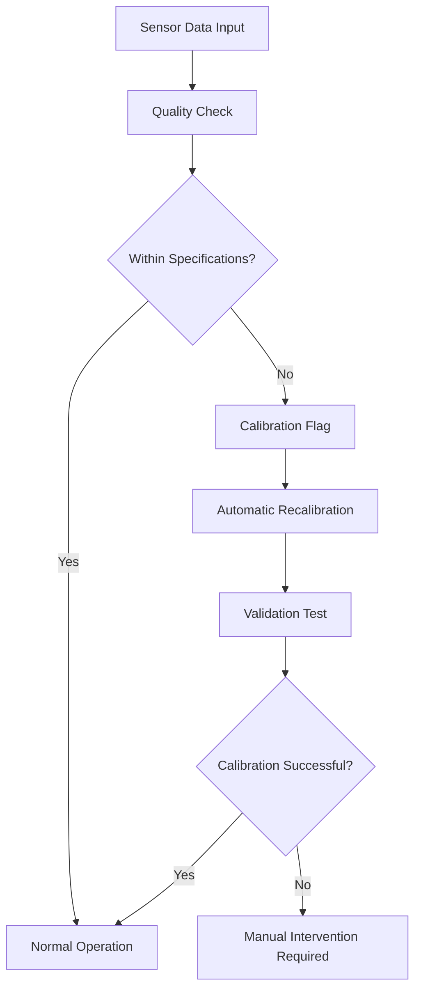

# Systems Calibrations Documentation

## Abstract

This document provides comprehensive calibration procedures for integrated positioning systems in land surveying operations, covering GPS receivers, UWB-based Alternative Positioning Systems (APS), Inertial Navigation Systems (INS), and odometry sensors. Proper calibration ensures seamless transitions between positioning modes while maintaining 10 cm³ volume accuracy requirements.

## 1. System Overview

### 1.1 Multi-Modal Positioning Architecture

The rover employs a sophisticated multi-sensor positioning system comprising:

- **Primary GPS System**: Standard GNSS receiver with RTK capability for centimeter-level accuracy
- **Alternative Positioning System (APS)**: UWB-based multilateration using drone network
- **Inertial Navigation System (INS)**: IMU providing acceleration, angular velocity, and orientation
- **Odometry System**: Wheel encoders for dead-reckoning navigation
- **Timing Systems**: Standard clock (GPS synchronization) and precision clock (UWB operations)

### 1.2 Calibration Philosophy

Calibration procedures focus on establishing consistent coordinate frames, timing synchronization, and sensor bias characterization across all positioning modalities. The goal is to enable seamless transitions between systems while maintaining positioning accuracy within the 10 cm³ volume constraint.

**Coordinate Frame Hierarchy:**
- World Coordinate System (WGS84/UTM)
- Local Survey Coordinate System
- Rover Body Frame
- Individual Sensor Frames

## 2. GPS System Calibrations

## 3. UWB Alternative Positioning System Calibrations

## 4. Inertial Navigation System Calibrations

## 5. Odometry System Calibrations

### 5.1 Wheel Encoder Calibration

## 6. Clock Synchronization Systems

### 6.1 Finding Clock Offsets

## 7. System Integration Calibrations

### 7.1 Multi-Sensor Fusion Calibration

## 8. Calibration Validation and Quality Assurance

### 8.2 Continuous Calibration Monitoring

**Real-Time Quality Indicators:**

Monitor calibration health during operations:

**Calibration Drift Detection:**
