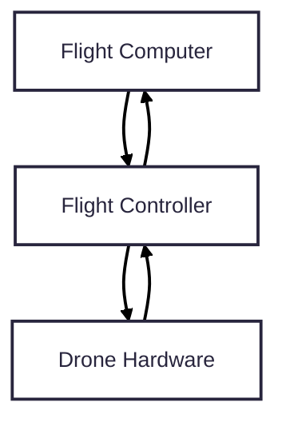
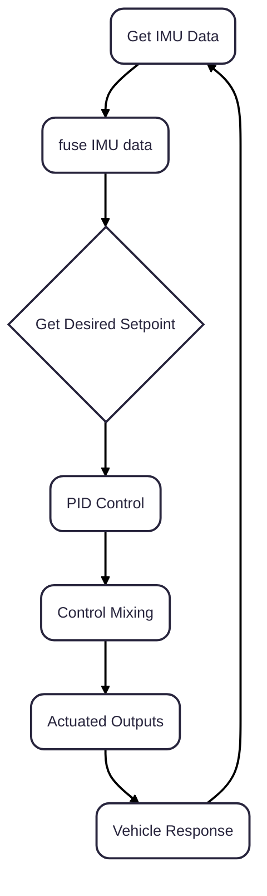
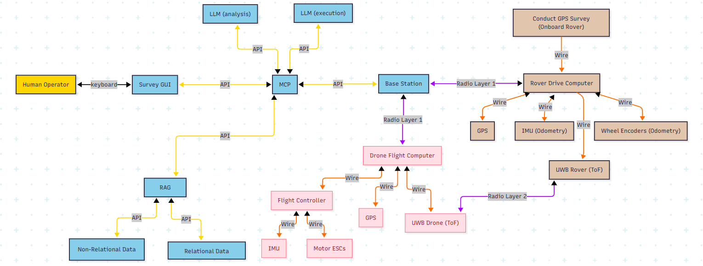
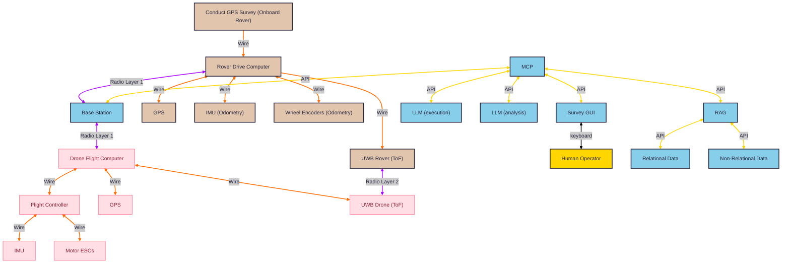
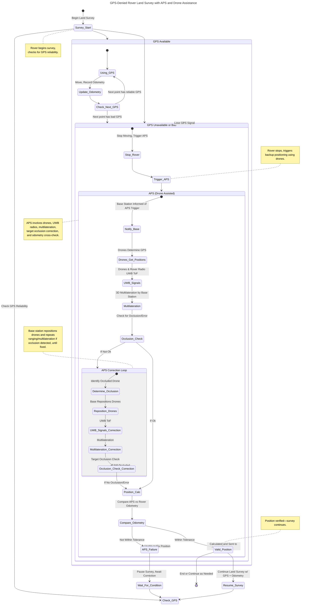

## Drone software stack

```mermaid
---
config:
  theme: redux
---
flowchart TD
    n3["Flight Computer"] --> n2["Flight Controller"]
    n2 --> n1["Drone Hardware"]
    n1 --> n2
    n2 --> n3
    n3@{ shape: rect}
    n2@{ shape: rect}
    n1@{ shape: rect}

```

## dRehmFlight (flight controller) state diagram

```mermaid
---
config:
  theme: redux
---
flowchart TD
    A["Get IMU Data"] --> B["fuse IMU data"]
    B --> n1["Get Desired Setpoint"]
    n1 --> n2["PID Control"]
    n2 --> n3["Control Mixing"]
    n3 --> n4["Actuated Outputs"]
    n4 --> n5["Vehicle Response"]
    n5 --> A
    A@{ shape: rounded}
    B@{ shape: rounded}
    n1@{ shape: diam}
    n2@{ shape: rounded}
    n3@{ shape: rounded}
    n4@{ shape: rounded}
    n5@{ shape: rounded}
```

## Comprehensive Big Picture Software stack diagram

```mermaid
---
config:
  theme: redux
  layout: fixed
---
flowchart TD
    n1["Base Station"] <-- Radio Layer 1 --> n2["Drone Flight Computer"]
    n2 <-- Wire --> n3["Flight Controller"] & n6["GPS"] & n7["UWB Drone (ToF)"]
    n3 <-- Wire --> n4["IMU"] & n5["Motor ESCs"]
    n8["Rover Drive Computer"] <-- Wire --> n9["GPS"] & n12["IMU (Odometry)"] & n13["Wheel Encoders (Odometry)"]
    n8 -- Wire --> n10["UWB Rover (ToF)"]
    n10 <-- Radio Layer 2 --> n7
    n11["Conduct GPS Survey (Onboard Rover)"] -- Wire --> n8
    n8 <-- Radio Layer 1 --> n1
    n15["Survey GUI"] <-- keyboard --> n16["Human Operator"]
    n18["MCP"] <-- API --> n15 & n17["LLM (execution)"] & n14["LLM (analysis)"] & n1 & n19["RAG"]
    n19 <-- API --> n20["Relational Data"] & n21["Non-Relational Data"]
    n1@{ shape: rect}
    n2@{ shape: rect}
    n3@{ shape: rect}
    n6@{ shape: rect}
    n7@{ shape: rect}
    n4@{ shape: rect}
    n5@{ shape: rect}
    n8@{ shape: rect}
    n9@{ shape: rect}
    n12@{ shape: rect}
    n13@{ shape: rect}
    n10@{ shape: rect}
    n11@{ shape: rect}
    n15@{ shape: rect}
    n16@{ shape: rect}
    n18@{ shape: rect}
    n17@{ shape: rect}
    n14@{ shape: rect}
    n19@{ shape: rect}
    n20@{ shape: rect}
    n21@{ shape: rect}
     n1:::Class_04
     n2:::Rose
     n3:::Rose
     n6:::Rose
     n7:::Rose
     n4:::Rose
     n5:::Rose
     n8:::Class_02
     n9:::Class_02
     n12:::Class_02
     n13:::Class_02
     n10:::Class_02
     n11:::Class_02
     n15:::Class_04
     n18:::Class_04
     n17:::Class_04
     n14:::Class_04
     n19:::Class_04
     n20:::Class_04
     n21:::Class_04
    classDef Class_02 fill:#E1C5AD
    classDef Class_04 fill:#87CEEB
    classDef Rose stroke-width:1px, stroke-dasharray:none, stroke:#FF5978, fill:#FFDFE5, color:#8E2236
    style n16 fill:#FFD600
    linkStyle 0 stroke:#AA00FF,fill:none
    linkStyle 1 stroke:#FF6D00,fill:none
    linkStyle 2 stroke:#FF6D00,fill:none
    linkStyle 3 stroke:#FF6D00,fill:none
    linkStyle 4 stroke:#FF6D00,fill:none
    linkStyle 5 stroke:#FF6D00,fill:none
    linkStyle 6 stroke:#FF6D00,fill:none
    linkStyle 7 stroke:#FF6D00,fill:none
    linkStyle 8 stroke:#FF6D00,fill:none
    linkStyle 9 stroke:#FF6D00,fill:none
    linkStyle 10 stroke:#AA00FF,fill:none
    linkStyle 11 stroke:#FF6D00,fill:none
    linkStyle 12 stroke:#AA00FF,fill:none
    linkStyle 14 stroke:#FFD600,fill:none
    linkStyle 15 stroke:#FFD600,fill:none
    linkStyle 16 stroke:#FFD600,fill:none
    linkStyle 17 stroke:#FFD600,fill:none
    linkStyle 18 stroke:#FFD600,fill:none
    linkStyle 19 stroke:#FFD600,fill:none
    linkStyle 20 stroke:#FFD600,fill:none
```

## Comprehensive Big Picture state diagram

```mermaid
---
title: GPS-Denied Rover Land Survey with APS and Drone Assistance
---
stateDiagram-v2
    [*] --> Survey_Start: Begin Land Survey

    Survey_Start --> Check_GPS: Check GPS Reliability

    state "GPS Available" as GPS_Available {
        [*] --> Using_GPS
        Using_GPS --> Update_Odometry: Move, Record Odometry
        Update_Odometry --> Check_Next_GPS
        Check_Next_GPS --> Using_GPS: Next point has reliable GPS
        Check_Next_GPS --> GPS_Unavailable: Next point has bad GPS
    }

    state "GPS Unavailable or Bad" as GPS_Unavailable {
        [*] --> Stop_Rover: Stop Moving, Trigger APS
        Stop_Rover --> Trigger_APS
        Trigger_APS --> APS_Active
    }

    state "APS (Drone Assisted)" as APS_Active {
        [*] --> Notify_Base: Base Station Informed of APS Trigger
        Notify_Base --> Drones_Get_Positions: Drones Determine GPS
        Drones_Get_Positions --> UWB_Signals: Drones & Rover Radio UWB ToF
        UWB_Signals --> Multilateration: 3D Multilateration by Base Station
        Multilateration --> Occlusion_Check: Check for Occlusion/Error

        state "APS Correction Loop" as APS_Correction {
            [*] --> Determine_Occlusion: Identify Occluded Drone
            Determine_Occlusion --> Reposition_Drones: Base Repositions Drones
            Reposition_Drones --> UWB_Signals_Correction: UWB ToF
            UWB_Signals_Correction --> Multilateration_Correction: Multilateration
            Multilateration_Correction --> Occlusion_Check_Correction: Target Occlusion Check

            Occlusion_Check_Correction --> APS_Correction: If Still Occluded
            Occlusion_Check_Correction --> Position_Calc: If No Occlusion/Error
        }

        Occlusion_Check --> Position_Calc: If Ok
        Occlusion_Check --> APS_Correction: If Not Ok

        Position_Calc --> Compare_Odometry: Compare APS vs Rover Odometry
        Compare_Odometry --> Valid_Position: Within Tolerance
        Compare_Odometry --> APS_Failure: Not Within Tolerance
    }

    APS_Active --> Valid_Position: Calculated and Sent to Rover
    Valid_Position --> Resume_Survey: Continue Land Survey w/ GPS + Odometry

    APS_Active --> APS_Failure: Unable to Fix Position
    APS_Failure --> Wait_For_Condition: Pause Survey, Await Correction
    Wait_For_Condition --> Check_GPS

    Survey_Start --> GPS_Available
    Survey_Start --> GPS_Unavailable
    GPS_Available --> GPS_Unavailable: Lose GPS Signal
    Valid_Position --> [*]: End or Continue as Needed
    Resume_Survey --> Check_GPS

    %% Notes
    note right of Survey_Start
      Rover begins survey,
      checks for GPS reliability.
    end note
    note left of Trigger_APS
      Rover stops, triggers backup positioning using drones.
    end note
    note right of APS_Active
      APS involves drones, UWB radios, multilateration,
      target occlusion correction, and odometry cross-check.
    end note
    note left of APS_Correction
      Base station repositions drones and repeats
      ranging/multilateration if occlusion detected, until fixed.
    end note
    note left of Valid_Position
      Position verified—survey continues.
    end note
```