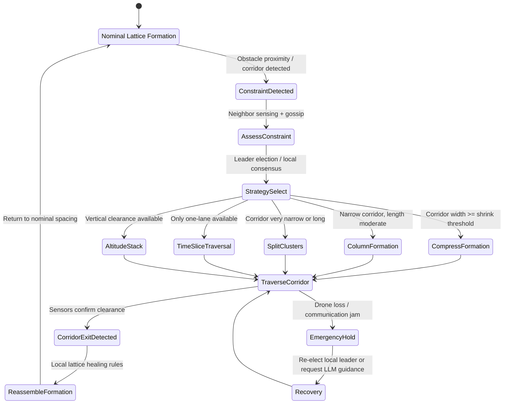
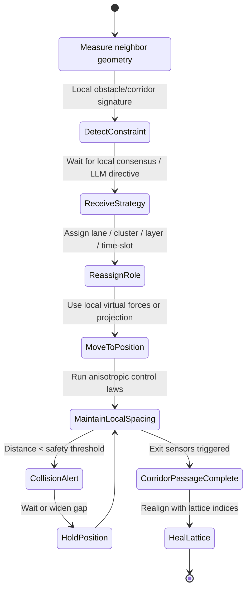
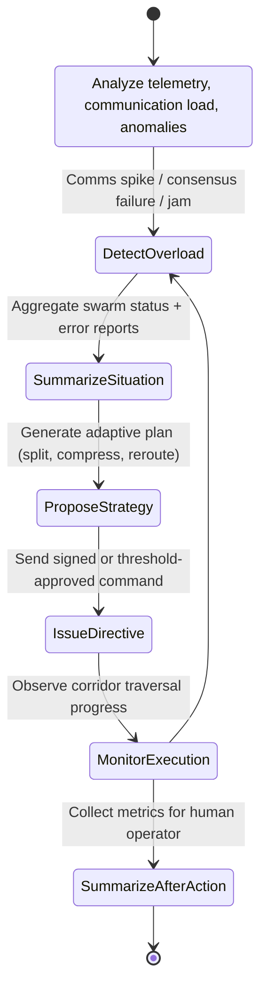
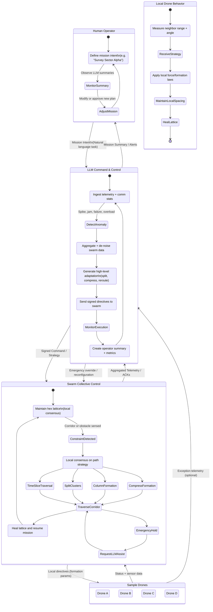

I have the following documentation regarding creating an easily scalable command and control network for drone swarms while maintaining communication security. Please help me to research and understand what techniques would be used where and how. Please ask clarifying questions as needed.

my objectives are the following:
- develop high level theory for drone swarm communication simplicity and security - maintain integrity while not hindering high performance - how to keep the communication secure, decentralized or independent of a single source of truth, while maintaining high performance in communication effectiveness
- develop high level theory for scalable drone swarm formation control maintain ideal communication formations and be able to scale the formation using lattice transformations and possible leader/follower schema with succession
- develop high level theory for integration of an LLM, or multiple LLMs if needed to be able to observe and assist in drone swarm control when algorithms start becoming orverwhelmed, or demand for communication spikes when multiple agents get jammed. Effectively, the LLMs will be used to "de-noise" the environment that the agents are in, so that large bursts in communications between many drones due to verification algorithms and more can be mitigated or delegated to LLMs before the entire drone swarm becomes overwhelemed with messages and more. 

Thanks for sharing your objectives and documentation. To provide a thorough and well-targeted theoretical overview, could you please clarify a few key points:

Drone Platform and Scale: How many drones do you envision in the swarm at scale (tens, hundreds, thousands)? Are they mostly homogeneous or heterogeneous?

A homogeneous drone swarm consists of identical drones with the same capabilities and software, making control and coordination simpler. In contrast, a heterogeneous drone swarm is made up of diverse drones with different hardware, sensors, and programming, allowing them to perform more complex tasks, divide labor, and adapt to dynamic environments

Performance Expectations: What latency and throughput constraints do you expect the swarm communication to meet?

Communication Constraints: Are there bandwidth/power limitations that should influence the communication architecture?

LLM Role Specifics: How often do you expect the LLM to intervene or assist? Should it be reactive (on error/spike) or proactive (monitoring)?

Environment: Are these swarms intended to operate in GPS-denied or adversarial/jammed environments most of the time?

Once I have that context, I’ll develop a detailed high-level theoretical framework covering scalable formation control, secure decentralized communication, and LLM-based swarm resilience support.

1. I want to start small but i would like to be able to have the limitations of scaling be the amount of command and control infrastructure i can deploy. So ideally i would like to be able to scale to thousands of drones, but i would like to start with a swarm of 10-20 drones. You can consider nearly all drones to be homogenous, but they will be communication with heterogeneous agents such as rovers on the ground, marine vessels, and more.
2. I do not have any expectations as this is part of what i am researching.
3. Don't worry about bandwidth or power limitations for now, I simply want high level theory that can be applied to any situation. I will take care of implementation of that theory.
4. The LLM should be both reactive and proactive. I would like it to be able to monitor the swarm and be able to step in when needed, but also be able to step in when there are spikes in communication or other issues that arise. The point of the LLM is to augment a human operator and help with management of notifications and communication overload.
5. Yes, the swarms will be operating in GPS denied and adversarial environments, not all the time, but often enough that it needs to be considered in the high level theory. 

Swarm Formation Control

Drone swarms can self-organize into lattice formations (e.g. hexagonal/triangular) for maximal area coverage and stable connectivity. Studies show that distributed force-based algorithms drive dozens or hundreds of UAVs into a regular hexagonal lattice, achieving coverage with the fewest agents and bounded multi-hop communication paths
researchgate.net
. Typically one drone plays a reference role (e.g. leader at center), and others use only local neighbor geometry (angles, ranges) to compute their “lattice coordinates” and move into position
cris.vtt.fi
researchgate.net
. Over time the swarm converges: each drone ends up with exactly six equidistant neighbors (L=6 for triangular) as in the left panel of the figure【54†】. Because the control laws use local virtual forces or consensus rules on relative positions, no global GPS or central commands are needed
researchgate.net
frontiersin.org
.

Each agent continuously adjusts using neighbor data alone. For example, Giusti et al. design two-local-force rules that align each drone’s link lengths and angles to a triangular or square pattern, without any inter-drone communication
frontiersin.org
. In practice, drones measure relative distances/angles (via vision, ranging, etc.) to their adjacent peers, and apply attraction/repulsion laws that settle them onto the lattice slots
researchgate.net
cris.vtt.fi
. Formal analysis shows these metrics (e.g. orientation coherence, degree distribution) converge to the exact (L,R)-lattice geometry
frontiersin.org
researchgate.net
. In simulations and field tests, even thousands of simple agents reliably form the pattern from arbitrary starts, demonstrating true scalability
researchgate.net
cris.vtt.fi
.

Self-healing and failure recovery: The same local rules automatically repair holes. When a drone fails or leaves, its neighbors notice a missing expected link. In effect they see a “gap” in the lattice and locally pull inward or rebalance virtual forces to fill it. Prior work shows that with a small error-correction routine, agents surrounding a hole can detect and patch it by shifting into the vacant slot
frontiersin.org
researchgate.net
. This has been numerically verified: missing nodes trigger neighbors to adjust and restore the lattice regularly
frontiersin.org
researchgate.net
. Crucially, no global coordinator is needed – each drone uses only neighbor info. The lattice simply grows outwards ring by ring as more drones join, so a swarm of thousands seamlessly scales by extending the pattern rather than adding central load
cris.vtt.fi
researchgate.net
.

Secure Decentralized Communication

To minimize radio load while preserving integrity, the swarm uses epidemic (gossip) protocols. Each drone forwards new messages to a random subset of its neighbors. Over time this peer-to-peer, “rumor‐monger” spreading ensures that alerts or commands reach the entire swarm without a central broadcast point
arxiv.org
. As Nafiul Khan et al. explain, gossip “agents periodically share updates with random peers… [so] the whole group attains a consistent view”
arxiv.org
. This avoids bottlenecks – no single drone is critical – and naturally handles join/leave events (newcomers simply start gossiping and their info diffuses)
arxiv.org
arxiv.org
. By capping each link’s message load to small randomized shares, gossip scales logarithmically rather than flooding.

In practice we deduplicate and aggregate messages: each broadcast packet carries a unique ID or timestamp so repeats are ignored. This stops endless loops. Instead of every drone ack’ing a broadcast to a base station, ACK aggregation builds a convergecast tree. For instance, leaf drones forward their ACK up to a parent, which bundles multiple acks into one packet towards the root. This approach (used in sensor networks) drastically cuts feedback chatter
researchgate.net
. In our context, local heads or cluster roots could aggregate confirmations, then forward a summary, reducing ACK traffic by orders of magnitude
researchgate.net
.

At the link layer, we use lightweight crypto and coding for integrity. Each message can include a short signature or MAC based on shared keys or an identity-based scheme. Nodes reject packets with bad signatures or replayed timestamps. Combined with gossip’s redundancy, this thwarts most tampering. Known defense methods (FHSS or beamforming) mitigate jamming: for example, drones may hop channels or narrow-beam during communication, limiting the effect of interference.

For trust and logging, blockchain/DAG concepts are applied at a conceptual level. Rather than energy-heavy chains, the swarm can use a crash-consensus or directed acyclic graph ledger. For example, SwarmRaft adapts the Raft protocol so that drones continuously agree on key state updates (e.g. positions, mission commands) even if GNSS is denied
arxiv.org
. In this scheme, when a node loses GPS, the others use Raft consensus on recent motion data to estimate its location – effectively reconstructing missing info via a shared ledger
arxiv.org
. This ensures the swarm stays coherent and data is tamper-evident without any central controller
arxiv.org
.

Alternatively, DAG-based ledgers (like IOTA’s Tangle) let every drone validate others’ transactions (messages) in parallel
mdpi.com
mdpi.com
. As Bai et al. note, DAG systems enable parallel, lightweight consensus: “each drone can validate transactions (messages) autonomously… eliminating the need for centralized verification”
mdpi.com
. This fits real-time swarms – high throughput and low delay. In simulation studies, adding such decentralized ledgers dramatically improved security: one report showed 99.3% data integrity and 42% better resilience to DDoS threats when blockchain-style validation was used
njublockchain.com
. In sum, by combining local gossip links with ledger records (either Raft logs or DAG transactions), the swarm maintains an authenticated, append-only history of commands and telemetry with no single failure point
arxiv.org
mdpi.com
.

GPS-denied and adversarial cases are covered by this same approach. Without satellites, drones use local ranging (vision, UWB) plus mutual consensus to localize. Even if a malicious node injects false data, the ledger/consensus rejects inconsistent entries. And because communications are pairwise-authenticated and gossip-propagated, even if links are jammed or spoofed at one frequency, alternate paths carry the information. Overall, the network is leaderless and crash-tolerant: just as gossip has no master broker, the ledger has no single authority. Partial failures (node crashes, signal loss) degrade performance smoothly rather than catastrophically – neighbors simply re-gossip lost info when they re-establish contact
arxiv.org
arxiv.org
.

LLM-Augmented Command and Control

We envision a two-tier architecture with one or more LLMs (e.g. ChatGPT-like agents) aiding human operators. At the lower tier, drones run standard control loops and formation algorithms. At the upper tier, an LLM runs on an edge node or ground station, ingesting summary telemetry and high-level directives. For example, prompt-driven systems have LLMs interpret natural-language mission orders and output drone instructions
arxiv.org
. In this pipeline, the human issues a task (“Survey area 𝐴 in grid formation”); the LLM parses it and generates a sequence of waypoints or formation commands in code form, using a pre-defined motion-library
arxiv.org
arxiv.org
. These commands are then distributed (via the decentralized communication stack) to the swarm. This allows operators to flexibly adjust missions: the human can simply re-prompt the LLM (“switch to spiral search”) and it will re-plan accordingly
arxiv.org
arxiv.org
.

Crucially, the LLM also monitors swarm health. Drones continuously send compressed status updates (position errors, link quality, sensor hits) to the ground. The LLM ingests this stream to detect anomalies or overloads. For instance, if a drone’s onboard formation control struggles (e.g. oscillating) or if network message volume spikes (suggesting congestion or an emergent event), the LLM can flag it. Prior work notes that either a human or LLM “should monitor the drones’ behavior and ensure they are performing desired tasks correctly”
arxiv.org
. In practice, the LLM acts as an intelligent watchdog: it filters and de-noises the raw data. Using its understanding of context, it triages alerts (e.g. “D6 lost neighbor; hole forming” or “GPS drift increasing”) and summarizes them. This summary is then presented to the operator, who sees only the critical issues instead of thousands of raw data points. In essence, the LLM embodies the Interaction Module described in UAV systems – aggregating situational data and flagging emergent problems for the human
arxiv.org
arxiv.org
.

Moreover, LLMs can proactively intervene. If communication patterns indicate possible jamming or spoofing (e.g. inconsistent location reports), the LLM can issue new high-level commands to adapt (switch frequencies, tighten formation, etc.). Or if a region is fully surveyed early, it can re-task drones elsewhere by negotiating with the swarm plan generator. Some systems even route LLM outputs back to on-board controllers: for example, “Swarm-GPT” uses GPT-3.5 to output time-series waypoints for all UAVs, with a safety-check module enforcing dynamics and obstacle constraints
arxiv.org
. Operators can then re-prompt (e.g. change formation shape) in real time, and the LLM updates the plan on the fly
arxiv.org
.

In summary, the LLM layer provides cognitive lift: it offloads high-level reasoning and communication triage from both the human and the drones’ numeric controllers. Drones remain decentralized and reactive, but the LLM keeps a bird’s-eye view. It ensures that when local algorithms hit limits (overloaded, corner cases, heavy chat), an adaptive agent steps in – either by simplifying commands, summarizing the swarm’s state, or issuing new directives. This synergy lets operators manage a thousand-drones swarm by conversing at a strategic level while the LLM bridges natural language, human intent, and the swarm’s decentralized protocols
arxiv.org
arxiv.org
.

Sources: The above framework is based on recent research in swarm formation and multi-agent communication
researchgate.net
frontiersin.org
cris.vtt.fi
, consensus and blockchain for UAVs
arxiv.org
mdpi.com
, and emerging LLM+robotics integration studies
arxiv.org
arxiv.org
. Each concept is applied at a theoretical level to ensure flexible, hardware-agnostic design in adversarial and GPS-denied settings.

so what if the lattice formation is too big to move in between objects but the swarm needs to transvers on a versy specific pathfinding algorithm on a certain altitude? how could the lattice formation not overpower basic formation control and allow scalable drone swarms to to be flexible in this manner? same applictation in GPS denied environments. when moving between two GPS denies areas and the swarm itself is larger than the area in between.

Great question — narrow passages and constrained corridors are a common real-world problem for latticed/swarm formations. Below I give a compact, high-level design pattern (with several alternative strategies) that lets a large hex/triangular lattice *deform* or *temporarily reorganize* to traverse tight, GPS-denied, or altitude-restricted passages while preserving decentralization, scalability, and security. I won’t dive into implementation details, just the conceptual building blocks and interaction patterns you can apply.

---

# Core idea (short)

Treat the lattice as **deformable** and **hierarchically composable**: when the swarm approaches a constrained region, it *detects* the constraint, *negotiates* a local traversal plan (split, compress, stack, or time-slice), *executes* a controlled morphing (local reassignments + local control laws), and *reassembles* back to the nominal lattice once through. All decisions can be made with local neighbor data + light-weight coordination (leader/follower, token, or small consensus) and optionally overseen/orchestrated by an LLM at the edge.

---

# Strategies (pick one or combine)

1. **Deformable lattice (elastic model)**

   * Model the hex lattice as an elastic mesh (virtual springs between neighbors). When entering a corridor, apply a *compression* or *shear* field along the corridor axis so nodes automatically move closer while repulsive constraints keep collisions avoided.
   * Advantages: Smooth, fully distributed; agents keep neighbor-based control laws.
   * Needs: local collision avoidance gain scheduling and limits on compression to avoid unsafe proximity.

2. **Morphing to a linear/column formation (fold & pass)**

   * Locally transform lattice indices into ordered **columns or lanes** aligned with the corridor. Use a leader/seed at the corridor entrance that assigns lane indices to nearby drones using a BFS or wavefront. Drones re-position into narrow columns (one or few wide) and traverse.
   * Use: temporary leader/follower links and token passing to maintain ordering.
   * Advantages: minimal footprint for very narrow paths.
   * Reassembly: a second wave reverses the mapping to lattice indices.

3. **Dynamic clustering / split-and-rejoin**

   * Split the swarm into smaller sub-swarms (clusters) that individually pass through the tight region (serially or in parallel if width allows). Each cluster runs its own small lattice or line formation and uses a rendezvous point on the far side to rejoin and heal the global lattice.
   * Advantages: scales to very constrained geometry and supports heterogeneous agents.
   * Management: cluster-heads aggregate ACKs and coordinate reassembly (reduces chatter).

4. **Altitude (Z) stacking / vertical layering**

   * If altitude is usable, transform horizontal density into vertical layers: keep hex spacing in horizontal but stagger drones on different Z layers (like floors) to pass over obstructions while preserving connectivity via inter-layer links.
   * Works in 3D spaces where vertical clearance exists.

5. **Time-division / staggered traversal (temporal multiplexing)**

   * Keep the lattice intact overall but permit a corridor to be used by a *time-sliced stream* of drones. A corridor token (logical permission) is passed; batches move through while others hold position. Use ACK aggregation or NACKs to confirm passage.
   * Good when space is too tight to physically reconfigure but you can temporally serialize movement.

6. **Local topological mapping + corridor embedding**

   * Build a local topological map (Voronoi/occupancy) from local sensors/peer ranging. Identify a “corridor corridor-axis” and compute a coordinate transform that maps lattice slots onto the corridor (a lattice-to-corridor embedding). This yields systematic mapping rules (which lattice index maps to which lane/altitude/time).

---

# Decision logic (how to choose at runtime)

* **Detect constraint**: drones at the boundary use local sensing (LIDAR/vision/UWB + neighbor geometry) and gossip to detect a chokepoint: width < threshold relative to lattice spacing or obstacles on both sides.
* **Estimate feasibility**: exchange minimal metadata (entry width, length, obstacle height) among boundary nodes and compute possible options: shrink factor, number of lanes, altitude layers, or cluster sizes.
* **Select strategy**: pick the lowest-cost strategy fitting constraints: (1) vertical stacking if altitude available, (2) column/line if width small but continuous, (3) split-and-rejoin if length is long or many agents, (4) time-slice if reconfiguration cost > time-slicing cost. This can be done via a local consensus (fast leader election among boundary drones) or by an LLM/edge if available.
* **Plan & assign roles**: assign temporary roles (corridor leader, tail guard, cluster-heads) and new target relative positions or ordering. Use a deterministic mapping function (e.g., sort by lattice index, by signal strength, or by hop-count) so assignments are consistent.

---

# Control primitives (distributed, local)

* **Elastic spring forces with constraints**: keep the same neighbor-based virtual force laws but add anisotropic stiffness (weaker along corridor axis to allow compression, stronger perpendicular to avoid collisions).
* **Projection onto constrained manifold**: compute each agent’s desired position via projection of its original lattice target onto the feasible corridor subspace (analogy: constrained optimization—minimize movement while satisfying corridor limits).
* **Leader-follower / string pulling**: designate a leader to pull a chain through the corridor; followers maintain inter-agent spacing using local relative measurements. Useful for column formations.
* **Token passing**: a light-weight logical token that grants permission to enter corridor; tokens can be aggregated, forwarded, and protected with MACs for security.
* **ACK aggregation & NACKs**: confirm reception of traversal orders and completion; only send NACK if failure to reduce chatter.

---

# GPS-denied specifics

* **Relative localization + cooperative SLAM**: use vision/UWB/IMU + neighbor observations to map the corridor and propagate that map via gossip or small DAG ledger entries. Drones can share hashed map snippets and merge them securely (consensus to detect map poisoning).
* **Cross-verification**: require at least k independent neighbor confirmations before adopting a topology change in adversarial conditions (threshold cryptography or quorum).
* **Secure role assignment**: authenticate temporary leaders/cluster-heads with short-lived keys or threshold signatures to prevent a compromised node from hijacking the traversal plan.

---

# LLM role (strategic orchestration & de-noise)

* **Proactive planning**: an LLM (edge/ground) ingests compressed corridor descriptors (width, length, obstacles) and proposes an optimal morphing strategy (split vs. compress vs. time-slice) with candidate parameters (compression factor, batch size).
* **On-demand coordination**: when comms spike or local consensus stalls, the LLM can propose deterministic, human-readable tie-breakers and broadcast them as signed mission directives.
* **Post-event summary**: the LLM summarizes the traversal (who went when, any failures) and proposes parameter updates for future similar corridors.
* **Security filter**: treat LLM as a “policy oracle” that checks that proposed reconfiguration orders comply with safety policies (max compression, min separation) before signing them into the ledger.

---

# Failure / safety policies

* **Graceful degradation**: if a drone fails mid-corridor, nearby drones reassign ranks from local neighbor lists and perform a local fill or hold depending on congestion. Use NACKs for missing expected ACKs.
* **Abort & fallback**: if reassembly is impossible or communication is lost, fall back to safe-hold positions and rebuild the lattice outward from survivors using local healing laws.
* **Safety envelopes**: hard limits on minimum inter-drone distance for compression; safety overrides in local controllers that refuse orders violating dynamics or collisions.

---

# Example traversal sequence (operational pattern)

1. **Detection**: boundary drones detect corridor (local sensing + gossip).
2. **Negotiate**: boundary nodes run a quick leader election and compute corridor geometry.
3. **Plan choice**: leader/LLM picks strategy (e.g., compress to 0.6 of spacing + two-lane).
4. **Assignment**: drones compute temporary target positions (lane & order) via deterministic mapping and start re-positioning using local virtual forces with anisotropic stiffness.
5. **Traverse**: assigned columns move through; token ensures spacing and collision avoidance; ACK aggregator on far side confirms passage.
6. **Reassembly**: after clearing corridor, nodes reassign lattice indices locally and run healing forces to restore nominal hex spacing. Ledger logs the transformation event for audit.
7. **Resume mission**: normal operations continue.

---

# Algorithms & math tools to consider (theory-level)

* **Elastic graph / spring-mass models** for deformable lattices.
* **Graph morphing / contraction** and **BFS / wavefront ordering** for index reassignment.
* **Model Predictive Control (distributed MPC)** for constraint-aware motion with safety constraints.
* **Voronoi-based corridor embeddings** for mapping lattice to constrained geometries.
* **RRT*/PRM** for corridor-aware path planning of cluster centroids (not individual drones).
* **Consensus protocols** (fast leader election, RAFT variants, light DAG) and **threshold cryptography** for role security.

---

# Tradeoffs (high level)

* **Compression vs. safety**: compressing spacing reduces footprint but raises collision risk and increases sensing/actuation accuracy requirements.
* **Splitting vs. latency**: splitting into clusters adds coordination overhead and potential reassembly time but handles the narrowest corridors.
* **Temporal serialization vs. throughput**: time-slicing is simple but slows overall mission throughput.
* **Centralized LLM orchestration vs. pure decentralization**: LLM helps with complex decisions but creates an additional dependency; keep rules that allow fully local fallback.

---

# Quick checklist you can use while designing

* Detect chokepoint and compute width/length/height locally.
* Choose morphing strategy (compress / column / split / time-slice / stack).
* Assign deterministic temporary roles & positions (BFS ordering or index-based).
* Use anisotropic virtual forces or projection to corridor manifold.
* Employ token/ACK aggregation for safe, ordered traversal.
* Secure role assignments and commands with short-lived signatures or threshold approval.
* Reassemble and run lattice healing; record the event in the ledger.

---

If you want next, I can:

* produce a small state diagram (decision flow) for the traversal decision logic, or
* sketch pseudocode for the local role-assignment mapping (no comms-heavy steps), or
* produce a short list of safety parameters (e.g., compression ratio vs. min safe distance) to guide controller tuning.

Which of those would be most useful next?

yes please create state diagrams using mermaid JS

Perfect — here are **MermaidJS state diagrams** that model the swarm’s decision-making and behavior for **corridor traversal and reassembly** in GPS-denied or constrained environments.

There are three related diagrams:

1. **Global swarm state logic** – how the swarm decides to morph, split, or reassemble.
2. **Local drone behavior** – how each drone behaves during the transition.
3. **LLM/Edge orchestration layer** – optional higher-level management when communication spikes or uncertainty is detected.

---

## 1️⃣ Global Swarm State Machine (Formation Morphing & Traversal)

---

## 2️⃣ Local Drone Behavior (Distributed Role Logic)

---

## 3️⃣ LLM/Edge Command & Control Oversight

---

### 🔍 How to read this systemically:

* The **Global Swarm Diagram** governs *what the swarm does as a whole*.
* The **Local Drone Diagram** governs *how each drone behaves autonomously* within its current mode.
* The **LLM Diagram** is an optional *supervisory loop* that activates when the swarm’s internal decision logic becomes uncertain, overloaded, or jammed.

---

Would you like me to **combine these three into one integrated layered architecture diagram** (e.g., with cross-layer arrows showing how LLM influences swarm and local states)? That would show how data and decisions flow across the hierarchy.

Excellent — here’s a **single integrated architecture + state diagram** using **MermaidJS** that shows:

* The **human operator** at the top issuing intent and receiving summaries.
* The **LLM Command & Control layer** in the middle acting as the cognitive and communication “de-noising” tier.
* The **Swarm Control layer** (formation logic, path traversal, local consensus).
* And several **sample drones** executing decentralized local control.

---

## 🧭 Integrated Human–LLM–Swarm State Architecture

---

### 🧩 How to interpret this:

* **Top (Human Layer):**
  The operator defines goals (“Survey corridor at 50 m altitude”), not micro-commands. They receive **summaries** and alerts filtered by the LLM.

* **Middle (LLM Layer):**
  Acts as a **cognitive filter + decision hub** — it monitors the swarm’s telemetry, recognizes overload or failures, and issues **high-level adaptive strategies** (split, compress, reroute).
  It ensures decisions remain human-readable and cryptographically validated (signed directives).

* **Bottom (Swarm + Drones):**
  The swarm layer handles **collective state logic** — whether to morph, traverse, or heal formations.
  Each **individual drone** executes local control rules (neighbor-based lattice behavior).

* **Bidirectional links:**

  * Human ↔ LLM → Swarm ensures high-level oversight without micromanagement.
  * LLM ↔ Swarm ensures the C2 system is **semi-autonomous and self-correcting**.
  * Swarm ↔ Drones maintains **local autonomy and resilience** in GPS-denied zones.

---

Would you like me to extend this diagram to also include **multi-LLM distributed coordination** (e.g., one airborne LLM node + one ground-based operator LLM for multi-domain coordination)? It would show how LLM nodes synchronize and divide decision authority while maintaining the same structure.

no that is too far into the future. I want to create a numbered checklist that will serve as a road map for software demonstrations I already have the following:

- agent class
- simluation GUI
- notification board GUI
- MCP enabled chat app for human to interact with LLM
- Postgresql for relational data - messages from LLM to drones, messages from human to LLM
- Qdrant for non relational data - drone telemetry, messages between drones (this is simply because it is such high volume and the ACK messages are not recorded, just the simple instructions and positions sent out or whatever)
- basic realistic GPS messaging (replicate NMEA and RTCM messages)
- LLM integration (using ollama and a specified model)

what other features and techniques are there, based on the documentation i provided and you found, that would add to a list of features to add?

Excellent — you’ve already got a very strong foundation (agent layer, GUI, message architecture, data layers, and LLM integration).

Based on your documentation (`3_UAV_drone_cybersecurity.md`, `swarm_c2-1.md`), plus the high-level frameworks we discussed (secure communication, lattice formation, LLM-augmented C2, decentralized control, GPS-denied operation), here’s a **structured, numbered roadmap** of feature modules and techniques you can progressively implement or simulate.

---

## 🧭 High-Level Roadmap: Scalable Secure Swarm Demonstrator

### **Phase 1 – Core Swarm Simulation Enhancements**

1. **Agent-to-Agent Networking Layer**

   * Implement simulated radio links with adjustable range, bandwidth, latency, and packet loss.
   * Support multiple protocols (LoRa, ESP-NOW, custom), plus togglable jamming/spoofing effects.

2. **Distributed Message Framework**

   * Add unique `CMD_ID` and timestamps to all swarm messages.
   * Integrate message de-duplication, gossip spreading, ACK aggregation, and NACK-based retransmit logic.

3. **Swarm Topology Visualizer**

   * GUI overlay showing communication mesh, lattice geometry, and active cluster links.
   * Enable toggling between lattice, column, cluster, and line formations.

4. **Formation Control Module**

   * Implement **hexagonal lattice positioning** using virtual-force or consensus rules.
   * Add deformation and self-healing (neighbor-based correction when a node drops).
   * Allow lattice compression/stretching and local re-indexing for corridor traversal.

5. **Constraint / Corridor Detection**

   * Simulate basic obstacle maps (corridors, bottlenecks).
   * Detect chokepoints via local neighbor geometry (reduced degrees of freedom) and trigger formation morphing.

---

### **Phase 2 – Security & Communication Integrity**

6. **Authentication Layer**

   * Add digital signature / MAC verification to each message using lightweight cryptography (AES-128 or ECC).
   * Include replay-attack prevention via timestamps or nonce IDs.

7. **Decentralized Ledger Prototype**

   * Simulate a **lightweight DAG or hash-chain log** of swarm messages for tamper-evidence.
   * Each drone stores a rolling hash of the last N messages and periodically verifies hashes with peers.

8. **Intrusion & Fault Simulation**

   * Introduce rogue agents (message spoofing, false data injection).
   * Implement anomaly detection routines that flag inconsistent telemetry or unauthorized command signatures.

9. **Resilience & Anti-Jamming Demonstration**

   * Add toggles to simulate jamming, frequency hopping, and adaptive power control.
   * Observe and log communication integrity and self-recovery performance.

10. **Encryption / Key Management Visualization**

    * Display which drones share session keys; add simple key exchange demo (e.g., identity-based encryption or simulated quantum key placeholder).

---

### **Phase 3 – GPS-Denied and Localization Modules**

11. **Relative Localization Framework**

    * Implement UWB-like relative ranging between drones.
    * Add cooperative SLAM or visual odometry stubs (synthetic data acceptable).
    * Enable swarm positioning and coordination using only relative frames.

12. **Consensus-Based Localization**

    * Simulate RAFT or gossip consensus on drone positions when GPS unavailable.
    * Log deviations between GPS and consensus-derived locations.

13. **Adversarial Spoofing Simulation**

    * Generate false GPS/NMEA messages to specific drones.
    * Implement cross-verification logic (multi-sensor or multi-drone confirmation) to reject spoofed data.

---

### **Phase 4 – LLM Command & Control Integration**

14. **Cognitive Command Gateway**

    * Expand your MCP chat app so the LLM receives and interprets operator intent (e.g., “Reform hex formation at 60m altitude”).
    * LLM outputs structured commands (JSON/SQL-like messages) to the PostgreSQL message queue.

15. **LLM Monitoring Daemon**

    * Stream telemetry summaries from Qdrant → LLM.
    * Let LLM generate anomaly summaries (“High comm load in cluster 3”) and push notifications to the GUI board.

16. **LLM Decision Hooks**

    * Allow LLM to issue corrective actions when:

      * communication load spikes,
      * swarm cohesion drops,
      * or a corridor constraint is detected.
    * Add audit logging to PostgreSQL for every LLM-generated directive.

17. **LLM Safety Filter**

    * Implement a policy-check layer where human operator must confirm or override risky LLM commands.
    * Include natural-language explanation (why LLM recommends a maneuver).

---

### **Phase 5 – Multi-Cluster & Scalability Features**

18. **Cluster-Head Election**

    * Enable dynamic election of local cluster leaders using a lightweight consensus (e.g., token or priority metric).
    * Allow leaders to act as relay nodes for ACK aggregation and telemetry summarization.

19. **Inter-Cluster Communication**

    * Implement message routing between clusters using compressed summaries rather than full broadcasts.
    * Support cluster merging/splitting for load balancing.

20. **Scalability Dashboard**

    * Real-time metrics: number of drones, message volume, integrity check failures, and LLM intervention frequency.

---

### **Phase 6 – Visualization, Analytics, and Replay**

21. **Mission Playback & Audit Trail**

    * Store hash-chained logs of key commands, telemetry, and LLM decisions.
    * GUI playback showing message propagation and formation morphing over time.

22. **Cyber-Attack Scenario Sandbox**

    * Create preset demonstrations:

      * GPS spoofing,
      * Communication jamming,
      * Rogue node injection,
      * Data tampering.
    * Measure recovery speed and communication resilience.

23. **Adaptive Lattice Morphing Demo**

    * Show swarm compression → corridor traversal → re-expansion and lattice healing automatically.

24. **LLM Assisted Reporting**

    * Use LLM to summarize post-mission data (“Swarm maintained 97% connectivity, 3 reconfiguration events detected”).
    * Automatically generate human-readable logs from PostgreSQL/Qdrant data.

---

### **Phase 7 – Optional Advanced Research Modules**

25. **Federated Learning Simulation**

    * Drones share model updates (weights) for cooperative reinforcement learning.
    * Secure with blockchain-logged parameter hashes.

26. **Differential Privacy / Secure Multiparty Computation**

    * Prototype privacy-preserving telemetry sharing using lightweight noise addition or MPC emulation.

27. **Energy & Resource Management Simulation**

    * Model battery depletion and scheduling for recharge/rotation within the swarm.
    * Evaluate communication efficiency vs. power use.

28. **Explainable AI Dashboard**

    * Visualize LLM reasoning chains and swarm decision trees for operator trust and debugging.

---

### ✅ Summary View

| Phase | Focus                  | Demonstrated Concept                        |
| ----- | ---------------------- | ------------------------------------------- |
| 1     | Core swarm + formation | Decentralized lattice and path traversal    |
| 2     | Security               | Integrity, authentication, ledger logging   |
| 3     | GPS-denied             | Consensus localization, spoofing resilience |
| 4     | LLM integration        | Cognitive oversight, natural-language C2    |
| 5     | Scalability            | Cluster coordination, message aggregation   |
| 6     | Visualization          | Audit, playback, metrics                    |
| 7     | Research               | Federated learning, privacy, explainability |

---

Would you like me to turn this roadmap into a **chronological development checklist** (with milestones like “Demo 1: Basic lattice formation,” “Demo 2: Corridor traversal,” “Demo 3: GPS denial recovery,” etc.) to guide incremental software demonstrations? That would give you a presentation-friendly structure.
