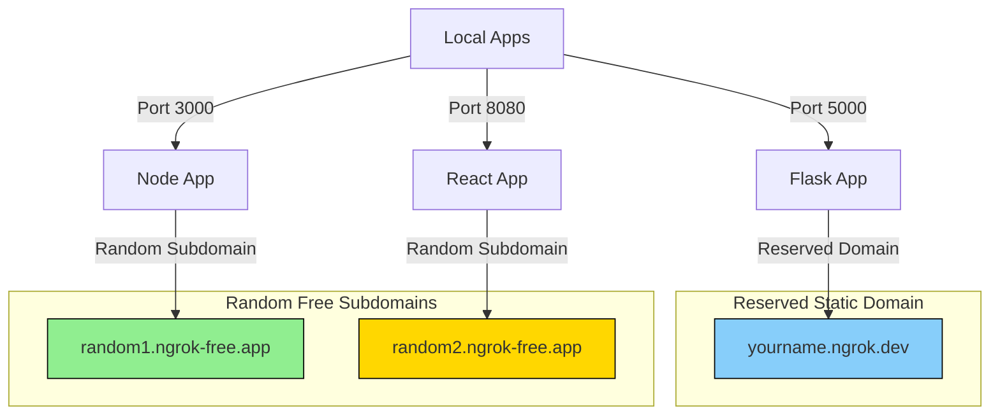

# 🚀 ngrok Free Plan: Install & Run Without sudo

This guide shows how to install ngrok locally (no sudo), use your free developer domain, and manage multiple apps on different ports using random subdomains.

> https://ngrok.com/docs/guides/device-gateway/linux/

## Table of Contents

- [🚀 ngrok Free Plan: Install & Run Without sudo](#🚀-ngrok-free-plan:-install-&-run-without-sudo)
  - [1️⃣ Sign up and get your token](#1️⃣-sign-up-and-get-your-token)
  - [2️⃣ Download ngrok](#2️⃣-download-ngrok)
  - [3️⃣ Install ngrok locally](#3️⃣-install-ngrok-locally)
  - [4️⃣ Add ngrok to your PATH](#4️⃣-add-ngrok-to-your-path)
  - [5️⃣ Authenticate ngrok](#5️⃣-authenticate-ngrok)
  - [6️⃣ Claim your free static domain](#6️⃣-claim-your-free-static-domain)
  - [7️⃣ Run your local app](#7️⃣-run-your-local-app)
  - [8️⃣ Expose your app](#8️⃣-expose-your-app)
    - [a) Use reserved domain (one app only)](#a)-use-reserved-domain-(one-app-only))
    - [b) Use random subdomains for additional apps](#b)-use-random-subdomains-for-additional-apps)
  - [9️⃣ Multiple apps workflow (Free Plan)](#9️⃣-multiple-apps-workflow-(free-plan))
  - [10️⃣ Optional: Automate multiple tunnels](#10️⃣-optional:-automate-multiple-tunnels)
  - [⚡ Free Plan Limits](#⚡-free-plan-limits)
  - [Run ngrok in the background](#run-ngrok-in-the-background)
    - [List background ngrok processes](#list-background-ngrok-processes)
    - [Stop a background ngrok process](#stop-a-background-ngrok-process)
    - [Optional: Use `disown`](#optional:-use-`disown`)


---

## 1️⃣ Sign up and get your token

1. Go to [ngrok.com](https://ngrok.com/) and create a **free developer account**.
2. Go to **Dashboard → Your Authtoken** and copy the token.

---

## 2️⃣ Download ngrok

```bash
cd ~
wget https://bin.equinox.io/c/bNyj1mQVY4c/ngrok-v3-stable-linux-amd64.tgz
```

---

## 3️⃣ Install ngrok locally

```bash
mkdir -p ~/.local/bin
tar -xvzf ngrok-v3-stable-linux-amd64.tgz -C ~/.local/bin
```

---

## 4️⃣ Add ngrok to your PATH

Add this to your `~/.bashrc` or `~/.zshrc`:

```bash
export PATH="$HOME/.local/bin:$PATH"
```

Reload your shell:

```bash
source ~/.bashrc
which ngrok
```

Expected output:

```
/home/youruser/.local/bin/ngrok
```

---

## 5️⃣ Authenticate ngrok

Link ngrok to your account:

```bash
ngrok config add-authtoken <your-auth-token>
```

> This saves your token to `~/.config/ngrok/ngrok.yml`.

Alternative methods:

* **Environment variable:**

  ```bash
  export NGROK_AUTHTOKEN=<your-auth-token>
  ```
* **Edit config file:**

  ```bash
  ngrok config edit
  ```

---

## 6️⃣ Claim your free static domain

1. In Dashboard → **Domains**, [here](https://dashboard.ngrok.com/domains), copy your free reserved domain:

```
yourname.ngrok.dev
```

2. This domain is **reserved** and works on **one local port at a time**.

---

## 7️⃣ Run your local app

Example Flask app:

```bash
python app.py   # localhost:5000
```

Docker example:

```bash
docker run -p 5000:5000 myapp
```

---

## 8️⃣ Expose your app

### a) Use reserved domain (one app only)

```bash
ngrok http --domain=yourname.ngrok.dev 5000
```

App is online at:

```
https://yourname.ngrok.dev
```

> Free plan limit: only **one app per reserved domain** at a time.

### b) Use random subdomains for additional apps

```bash
ngrok http 3000   # Example → https://blue-lion-123.ngrok-free.app
ngrok http 8080   # Example → https://happy-dog-42.ngrok-free.app
```

> Random subdomains are temporary and change each time ngrok starts.

---

## 9️⃣ Multiple apps workflow (Free Plan)

**Scenario:** You have multiple apps on different ports.

| App   | Port | Domain Type            |
| ----- | ---- | ---------------------- |
| Flask | 5000 | Reserved static domain |
| Node  | 3000 | Random subdomain       |
| React | 8080 | Random subdomain       |

**Commands:**

```bash
# Reserved domain → Flask
ngrok http --domain=yourname.ngrok.dev 5000

# Random subdomains → Node & React
ngrok http 3000
ngrok http 8080
```

💡 **Switch apps on reserved domain:** Stop current tunnel and start a new one on a different port:

```bash
ngrok http --domain=yourname.ngrok.dev 3000
```

---

## 10️⃣ Optional: Automate multiple tunnels

Edit `~/.config/ngrok/ngrok.yml`:

```yaml
version: "2"
tunnels:
  flask:
    addr: 5000
    proto: http
    domain: yourname.ngrok.dev   # reserved domain
  node:
    addr: 3000
    proto: http                  # random subdomain
  react:
    addr: 8080
    proto: http                  # random subdomain
```

Start all tunnels:

```bash
ngrok start --all
```

---

## ⚡ Free Plan Limits

* 1 reserved static domain
* 1 active tunnel on reserved domain at a time
* Multiple apps on different ports require random subdomains
* Temporary URLs: random subdomains change each start
* 40 connections/minute per tunnel
* No forced timeouts

---

✅ Now you can:

* Run **one app** on your reserved static domain
* Run **multiple apps** on different ports using **random free subdomains**
* Switch which app uses the reserved domain manually

---





Here’s a concise guide for running **ngrok in the background** on Linux/macOS:

---

## Run ngrok in the background

Use `nohup` or `&` to detach it from your terminal:

```bash
# Run a tunnel to port 8080 in the background
nohup ngrok http 8080 &
```

* `nohup` → ignores hangups, keeps process running after you close the terminal
* `&` → runs the command in the background
* Output is saved to `nohup.out` by default

You can also redirect logs:

```bash
nohup ngrok http 8080 > ngrok.log 2>&1 &
```

---

### List background ngrok processes

```bash
ps aux | grep ngrok
```

---

### Stop a background ngrok process

1. Find its **PID**:

```bash
ps aux | grep ngrok
```

2. Kill the process:

```bash
kill <PID>
```

Or forcefully:

```bash
kill -9 <PID>
```

---

### Optional: Use `disown`

```bash
ngrok http 8080 &
disown
```

* Detaches the process from the shell
* Keeps it running even after logging out

---

This lets you keep ngrok tunnels active without keeping a terminal open.

---

If you want, I can make a **one-line workflow** for running **multiple ngrok tunnels in the background** for different apps and ports.
