* llama 8b for generating Transcripts, titles, descriptions, tags
* vibe voice for gernerating voiceovers
* WAN video, wan2.2 for generating video
* Stable Diffusion

- Generate video with WAN2.2 at your desired resolution (e.g., 1080p, 30 FPS).
- Use Flowframes with RIFE model to interpolate to higher frame rate (e.g., 60–120 FPS).
- Optionally, post-process in Stable Diffusion or VFX tools for style enhancements.

- Keyword research / trending topics / SEO integration
- Platform-specific formatting (hashtags, emojis, CTAs, character limits)
- Automated cross-platform publishing
- Approval workflow / human review
- Analytics & performance feedback
- Automated media suggestion based on content
- Scheduling / automation for regular posting

# Open-Source AI Content Workflow Roadmap

## 1. Content Generation (Text & SEO/Keywords)

**Goal:** Generate platform-specific posts with relevant keywords, hashtags, CTAs, and emojis.

**Tools & Libraries:**
- **LLaMA 3 8B** → text generation (titles, descriptions, scripts, captions)
- **LangChain / LlamaIndex** → build structured pipelines for prompts and context

**Keyword / Trend Discovery:**
- Google Trends API or pytrends (trending topics)
- SERPAPI free tier (keyword suggestions, competitor content)
- Open-source web scraping: BeautifulSoup + requests for niche trend discovery

**Hashtags / Emojis / CTA Placement:**
- Use prompt engineering in LLaMA to output hashtags & CTAs per platform
- Optional: small rules engine to respect character limits

**Pipeline Example:**
1. Fetch trending keywords for niche/topic.
2. Generate multiple captions or post drafts with LLaMA, injecting keywords.
3. Append hashtags/emoji/CTA using a post-processing script.

---

## 2. Multimedia Generation (Images, Video, Voice)

**Goal:** Generate videos with narration and optionally stylized visuals.

**Tools & Libraries:**
- **WAN2.2** → base video generation (1080p, 30 FPS)
- **Flowframes + RIFE** → interpolate to higher FPS (60–120 FPS)
- **Stable Diffusion** → style transfer / image enhancements / background generation
- **VIBE Voice** → generate voiceovers
- Optional: CLIP similarity scoring to select relevant visuals for content

**Pipeline Example:**
1. Generate video from WAN2.2.
2. Create voiceover with VIBE Voice from transcript.
3. Use Flowframes + RIFE to interpolate frames.
4. Apply Stable Diffusion for style or background adjustments.
5. Combine video + audio into final output.

---

## 3. Platform Formatting & Optimization

**Goal:** Ensure content meets platform-specific requirements (character limits, hashtags, emojis, video length).

**Tools & Libraries:**
- Custom Python scripts for formatting:
  - Trim captions to character limits (X/Twitter 280, LinkedIn 700, Instagram 2200, etc.)
  - Limit hashtags and emoji per platform
  - Split multi-post campaigns
- Optional: LangChain rules or templates to automate this in generation stage

---

## 4. Cross-Platform Publishing

**Goal:** Automatically post content to multiple social networks.

**Tools & Libraries:**
- Twitter/X: Tweepy
- Instagram: instagrapi or Selenium automation
- LinkedIn: linkedin-api (unofficial) or Selenium
- Facebook/Meta: Graph API via facebook-sdk
- TikTok: TikTok-Api or Selenium
- Optional: Airflow / Prefect / Cron jobs for scheduling

**Pipeline Example:**
1. Generate formatted content per platform.
2. Trigger posting API for each network.
3. Log post ID & timestamp for tracking.

---

## 5. Approval / Human-in-the-loop Workflow

**Goal:** Optional human review before posting.

**Tools & Libraries:**
- SMTP / Gmail API → send formatted emails with preview
- Slack / Mattermost / Telegram bots → approval buttons
- Python web dashboard → approve/reject posts (Flask / FastAPI)
- Optional: Google Sheets for manual review workflow

**Pipeline Example:**
1. Draft post + media ready.
2. Send email/slack/telegram message to reviewer.
3. Reviewer approves → triggers publishing scripts.

---

## 6. Analytics & Feedback Loop

**Goal:** Track engagement, optimize future posts.

**Tools & Libraries:**
- Platform APIs → retrieve post metrics (likes, shares, comments, views)
- Google Analytics / YouTube Analytics API → track clicks & impressions
- Python (Pandas / Matplotlib / Seaborn) → visualize performance
- Optional: Metabase / Superset → dashboards for multi-platform overview

**Pipeline Example:**
1. Pull metrics weekly/daily.
2. Analyze top-performing posts.
3. Adjust LLaMA prompts for better engagement (keywords, tone, style).

---

## 7. End-to-End Automation

**Goal:** Full workflow from content generation → approval → publishing → analytics.

**Tools & Libraries:**
- Airflow / Prefect → orchestrate the whole pipeline
- Cron jobs → lightweight scheduling for scripts
- Docker → containerize workflow for reproducibility

**Pipeline Example:**
- Keyword Discovery → Content Generation → Multimedia Generation → Formatting → Approval → Posting → Analytics

---

## Key Gaps Filled by Open-Source Tools

- **Keywords / Trends:** pytrends, SERPAPI
- **Cross-platform posting:** Tweepy, instagrapi, TikTok-Api
- **Approval workflow:** Gmail API, Slack/Mattermost bots
- **Analytics:** Pandas/Matplotlib, Google Analytics API
- **Scheduling / Automation:** Airflow, Prefect, Cron
- **Media suggestions:** CLIP similarity for images/videos

```mermaid
flowchart TD
    %% Stage 1: Keyword & Trend Discovery
    A[Keyword & Trend Discovery] --> B[Content Generation]
    subgraph Keyword_Discovery
        A1[Google Trends / pytrends] --> A
        A2[SERPAPI / Web Scraping] --> A
    end

    %% Stage 2: Content Generation
    B --> C[Multimedia Generation]
    subgraph Content_Generation
        B1[LLaMA 8B for text] --> B
        B2[LangChain/LlamaIndex templates] --> B
        B3[Hashtag, CTA, Emoji placement scripts] --> B
    end

    %% Stage 3: Multimedia Generation
    C --> D[Platform Formatting & Optimization]
    subgraph Multimedia_Generation
        C1[WAN2.2 Video Generation] --> C
        C2[Flowframes + RIFE FPS Interpolation] --> C
        C3[Stable Diffusion Style / Enhancement] --> C
        C4[VIBE Voice for Narration] --> C
        C5[Optional: CLIP similarity media selection] --> C
    end

    %% Stage 4: Platform Formatting
    D --> E[Approval Workflow]
    subgraph Formatting
        D1[Trim to platform limits] --> D
        D2[Adjust hashtags, emojis, CTAs] --> D
        D3[Split multi-post campaigns] --> D
    end

    %% Stage 5: Approval Workflow
    E --> F[Cross-Platform Publishing]
    subgraph Approval
        E1[Email / Gmail API] --> E
        E2[Slack / Telegram bots] --> E
        E3[Google Sheets / Flask Dashboard] --> E
    end

    %% Stage 6: Cross-Platform Publishing
    F --> G[Analytics & Feedback Loop]
    subgraph Publishing
        F1[Tweepy for X/Twitter] --> F
        F2[instagrapi / Selenium for Instagram] --> F
        F3[LinkedIn API / Selenium] --> F
        F4[Facebook Graph API] --> F
        F5[TikTok-Api / Selenium] --> F
        F6[Airflow / Prefect / Cron Scheduling] --> F
    end

    %% Stage 7: Analytics
    G --> H[Prompt / Strategy Optimization]
    subgraph Analytics
        G1[Platform APIs Metrics] --> G
        G2[Google Analytics / YouTube Analytics] --> G
        G3[Pandas / Matplotlib / Seaborn] --> G
        G4[Metabase / Superset Dashboards] --> G
    end

    %% Loop for optimization
    H --> B

```

